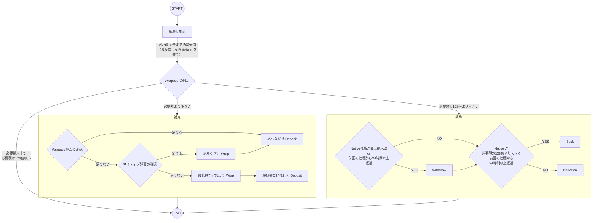

Balances の処理

```mermaid
graph TD
    Start((START)) --> StatsHistory[履歴の集計]
    StatsHistory -->|"必要額 = 今までの最大値\n（履歴無しなら default を使う）"| WrappedAmount{Wrapped の残高}
    WrappedAmount -->|必要額の128倍より大きい| 収穫
    WrappedAmount -->|"必要額以上で\n必要額の128倍以下"| End((END))
    WrappedAmount -->|必要額より小さい| 補充

    subgraph 補充
        CheckWrapped{Wrapped残高の確認} -->|足りる| DepositFull[必要なだけ Deposit]
        CheckWrapped -->|足りない| CheckNative
        CheckNative{ネイティブ残高の確認}
        CheckNative -->|足りる| WrapFull[必要なだけ Wrap]
        CheckNative -->|足りない| WrapLess[最低額だけ残して Wrap]
        WrapFull --> DepositFull
        WrapLess --> DepositLess[最低額だけ残して Deposit]
    end

    subgraph 収穫
        BeforeNative{Native残高が最低額未満\nor\n前回の収穫から24時間以上経過} -->|YES| Withdraw
        BeforeNative -->|NO| NativeAmount
        Withdraw --> NativeAmount{"Native が\n必要額の128倍より大きく\n前回の収穫から\n24時間以上経過"}
        NativeAmount -->|YES| Back
        NativeAmount -->|NO| NoAction
    end

    補充 --> End
    収穫 --> End
```
