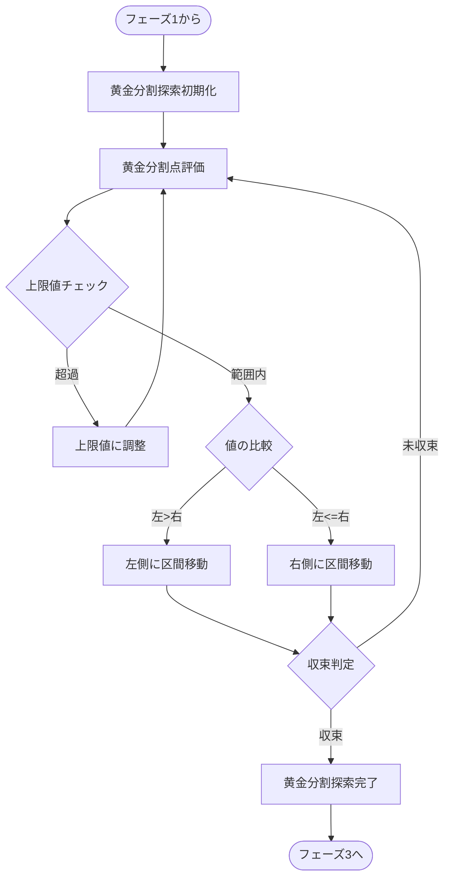
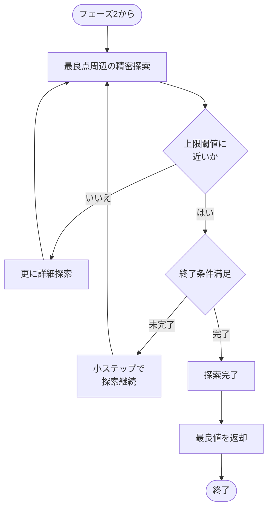
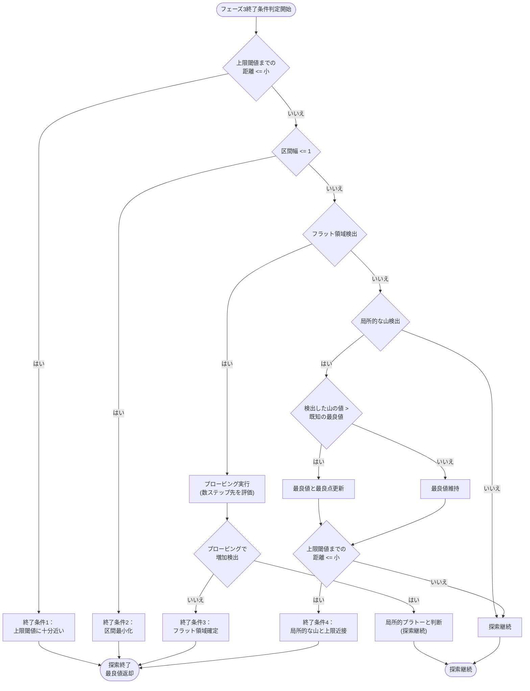

# 最適値探索アルゴリズム設計図

この図は以下の特性を持つ関数の最大値を探索するアルゴリズムのフローチャートです：
- 入力が小さすぎるとゼロ出力
- その後単調増加するが、増加率は徐々に低下
- 最大値を超えると突然ゼロに落ちる
- 入力には最大値（上限）がある

## フェーズ1: 有効範囲の特定

詳細な設計については [`optimization_algorithm_phase1.md`](./optimization_algorithm_phase1.md) を参照してください。

### フェーズ1の出力
フェーズ1の結果として、次の探索フェーズに渡す有効範囲 `(lower_bound, upper_bound)` を特定します。この範囲内に最適解が高確率で存在するよう、十分な余裕を持たせつつも、不要な範囲を排除します。

## フェーズ2: 黄金分割探索



## フェーズ3: 精密探索と結果返却



## アルゴリズムの主要フェーズ

### 1. 有効範囲の特定
- 非常に小さな値から始めて、徐々に値を増加させる
- ゼロから正の値に変わる「下限閾値」を特定
- さらに値を増やしていき、正の値からゼロに戻る「上限閾値」を特定
- これにより探索すべき「有効範囲」を確定する
- 入力上限値を常に考慮し、上限値を超える場合は上限値を上限閾値とする
- 全域でゼロの場合は早期に検出して終了

### 2. 黄金分割探索による効率的探索
- 有効範囲内で黄金分割探索を適用
- 黄金比（約0.618）を使って効率的に探索点を選定
- 評価値に基づいて探索範囲を継続的に絞り込む
- 入力上限値を常にチェックし、必要に応じて調整
- 区間が十分に狭くなるか、評価値の変化が小さくなったら次のフェーズへ

### 3. 境界近傍の精密探索
- 前フェーズで見つけた最良点周辺を詳細に探索
- 特に上限閾値（ゼロに落ちる境界）の直前を重点的に調査
- 小さなステップサイズで慎重に探索
- 十分な精度が得られたら探索完了

### 4. 終了条件
- 探索範囲が十分に狭くなった場合
- 連続する評価で値の改善が見られなくなった場合
- 全域でゼロ値の場合は早期に終了（特殊ケース）

## 収束判定の詳細フローチャート


## 収束判定に使用する条件

### 1. 区間幅による判定
区間内の整数点が1つ以下になったら、これ以上の探索は不要です。整数の世界では区間幅が1以下になると、その区間内に探索すべき新たな整数点が存在しません。

```rust
if right - left <= 1 {
    return true; // 収束
}
```

### 2. 連続評価値による判定
直近3回（または指定した回数）の評価結果が全て同じ値を示した場合、収束していると判断できます。これは特に、評価関数の出力が離散的な場合に有効です。

```rust
if last_values.len() >= 3 && 
   last_values.iter().all(|&val| val == last_values[0]) {
    return true; // 収束
}
```

### 3. 値の減少による判定
単調増加後に突然ゼロになる関数の特性を考慮すると、評価値が減少し始めた場合は、最大値を過ぎたか上限閾値に近づいている可能性があります。

```rust
if current_value < previous_value {
    return true; // 収束（または最大値を過ぎた）
}
```

## フェーズ3の詳細な終了条件フローチャート



## フェーズ3の終了条件詳細説明

### 1. 距離ベースの終了条件
- **上限閾値近接判定**：
  - 現在の探索点から上限閾値までの距離が「小」（3〜5程度）以下になった場合に探索を終了
  - 「上限閾値のすぐ手前まで探索した」と判断する条件

### 2. 評価値の変化パターンに基づく終了条件
- **フラット領域の検出**：
  - 直近5〜10点の評価値の変動幅が閾値以下、または傾きが十分に小さい場合にフラット領域と判定
  - フラット検出時にプロービング（数ステップ先の探索）を実施
  - プロービングで値の増加がなければ終了、増加があれば局所的プラトーと判断し探索継続

- **局所的な山の検出と処理**：
  - 連続する点で「増加→最大→減少」パターンを検出した場合、局所的な山として認識
  - 検出した山の値が既知の最良値より大きい場合は最良値を更新
  - 上限閾値までの距離が「小」以下なら探索終了、それ以外は探索継続

### 3. 探索範囲に基づく終了条件
- **区間最小化**：
  - 探索区間の幅が整数値の最小単位（1）以下になった場合に探索終了
  - 整数ドメインでは、これ以上細分化できないため自然な終了条件

### 4. 偶然性の排除とプラトー後の増加検出
- **偶然性の排除**：
  - 単一点での判断ではなく、複数点（5〜10点）での傾向を分析
  - 変動幅や傾きといった統計的指標を活用

- **プロービング戦略**：
  - フラット領域検出時に、数ステップ先の点を評価
  - 値が増加していれば局所的プラトーと判断し探索継続

### 5. 結果返却
- 探索中に記録された最良点の評価結果を返却
- 有効な値が見つからなかった場合はnullを返却
