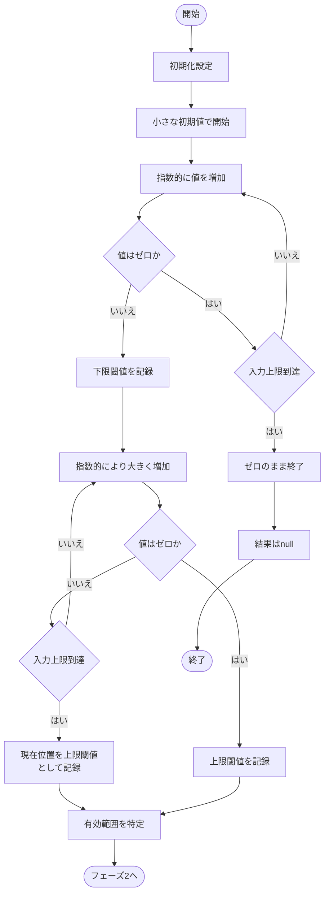
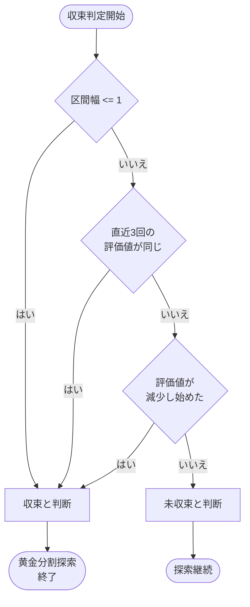
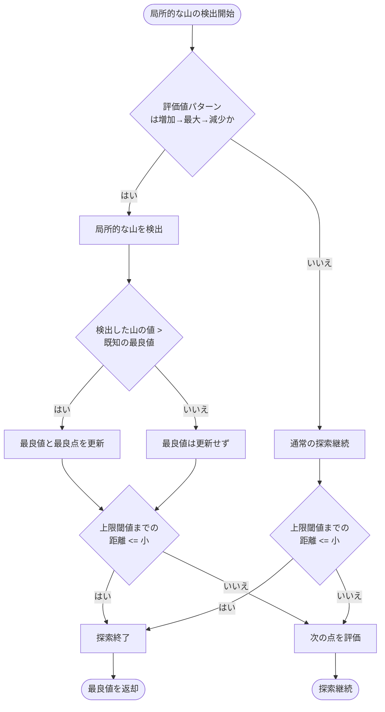

# 最適値探索アルゴリズム設計図

この図は以下の特性を持つ関数の最大値を探索するアルゴリズムのフローチャートです：
- 入力が小さすぎるとゼロ出力
- その後単調増加するが、増加率は徐々に低下
- 最大値を超えると突然ゼロに落ちる
- 入力には最大値（上限）がある

## フェーズ1: 有効範囲の特定



## フェーズ2: 黄金分割探索


## フェーズ3: 精密探索と結果返却


## アルゴリズムの主要フェーズ

### 1. 有効範囲の特定
- 非常に小さな値から始めて、徐々に値を増加させる
- ゼロから正の値に変わる「下限閾値」を特定
- さらに値を増やしていき、正の値からゼロに戻る「上限閾値」を特定
- これにより探索すべき「有効範囲」を確定する
- 入力上限値を常に考慮し、上限値を超える場合は上限値を上限閾値とする
- 全域でゼロの場合は早期に検出して終了

### 2. 黄金分割探索による効率的探索
- 有効範囲内で黄金分割探索を適用
- 黄金比（約0.618）を使って効率的に探索点を選定
- 評価値に基づいて探索範囲を継続的に絞り込む
- 入力上限値を常にチェックし、必要に応じて調整
- 区間が十分に狭くなるか、評価値の変化が小さくなったら次のフェーズへ

### 3. 境界近傍の精密探索
- 前フェーズで見つけた最良点周辺を詳細に探索
- 特に上限閾値（ゼロに落ちる境界）の直前を重点的に調査
- 小さなステップサイズで慎重に探索
- 十分な精度が得られたら探索完了

### 4. 終了条件
- 探索範囲が十分に狭くなった場合
- 連続する評価で値の改善が見られなくなった場合
- 全域でゼロ値の場合は早期に終了（特殊ケース）

## 収束判定の詳細フローチャート



## 収束判定に使用する条件

### 1. 区間幅による判定
区間内の整数点が1つ以下になったら、これ以上の探索は不要です。整数の世界では区間幅が1以下になると、その区間内に探索すべき新たな整数点が存在しません。

```rust
if right - left <= 1 {
    return true; // 収束
}
```

### 2. 連続評価値による判定
直近3回（または指定した回数）の評価結果が全て同じ値を示した場合、収束していると判断できます。これは特に、評価関数の出力が離散的な場合に有効です。

```rust
if last_values.len() >= 3 && 
   last_values.iter().all(|&val| val == last_values[0]) {
    return true; // 収束
}
```

### 3. 値の減少による判定
単調増加後に突然ゼロになる関数の特性を考慮すると、評価値が減少し始めた場合は、最大値を過ぎたか上限閾値に近づいている可能性があります。

```rust
if current_value < previous_value {
    return true; // 収束（または最大値を過ぎた）
}
```

## フェーズ3の局所的な山の検出と処理フローチャート



## 局所的な山の検出と処理に関する説明

### 検出条件
- 評価値が「増加→最大→減少」というパターンを示す場合に局所的な山と判断
- 連続する3点（p1, p2, p3）の評価値（v1, v2, v3）を比較
- 条件: v1 < v2 && v2 > v3 の場合に山を検出

### 処理ロジック
1. **最良値の更新**:
   - 検出した山の値が既知の最良値より大きい場合のみ更新
   - 最良値と最良点を常に記録し続ける

2. **上限閾値との距離による判断**:
   - 上限閾値までの距離 = 上限閾値 - 現在の点
   - 距離が「小」以下の場合: 探索終了（十分に上限閾値に近づいた）
   - 距離が「小」より大きい場合: 探索継続

### 距離の定義
- 「小」: 例えば 3〜5 程度の整数値（上限閾値のすぐ手前）

### 重要なポイント
- 常に最良値と最良点を記録し続ける
- 局所的な山を検出しても、上限閾値に十分近くない限り探索は継続

### 5. 結果返却
- 探索中に記録された最良点の評価結果を返却
- 有効な値が見つからなかった場合はnullを返却
