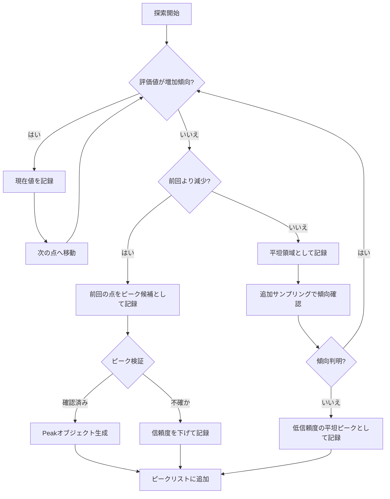
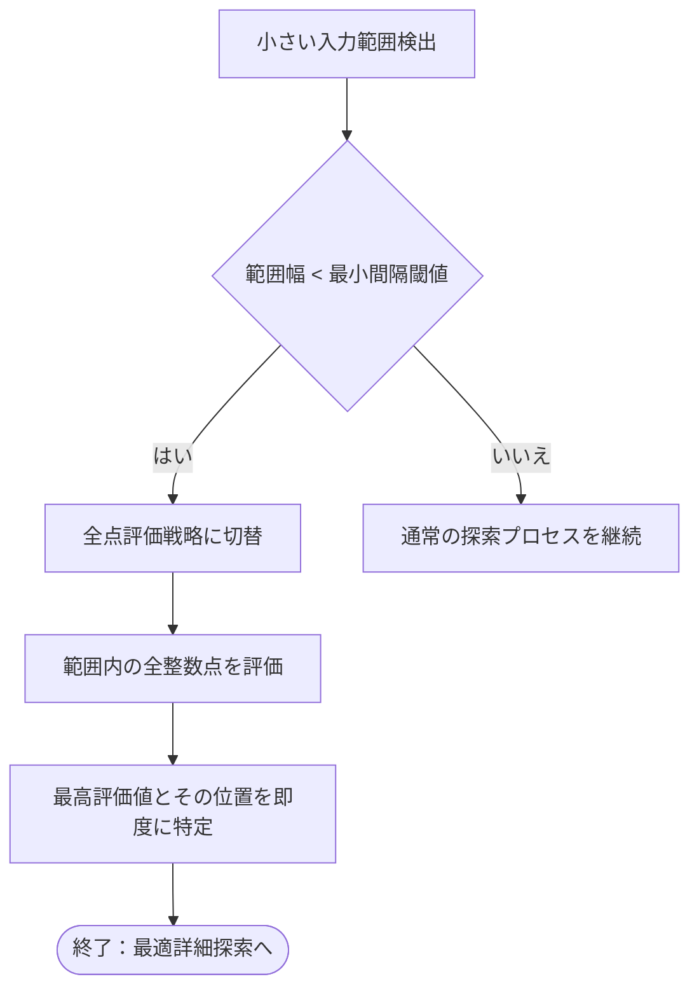
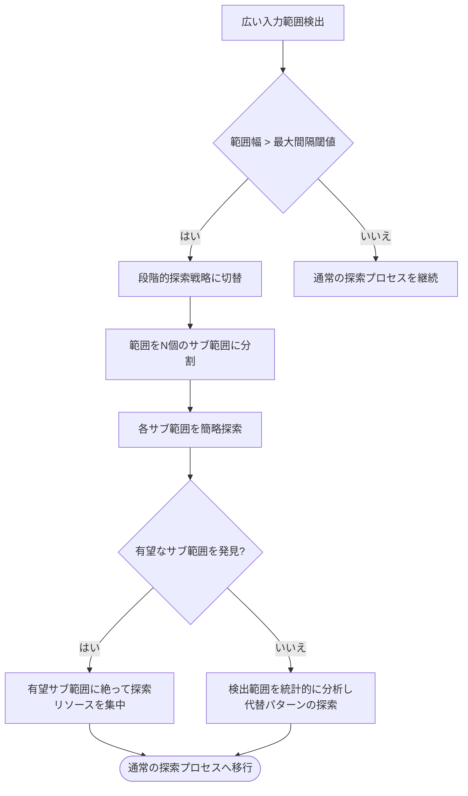
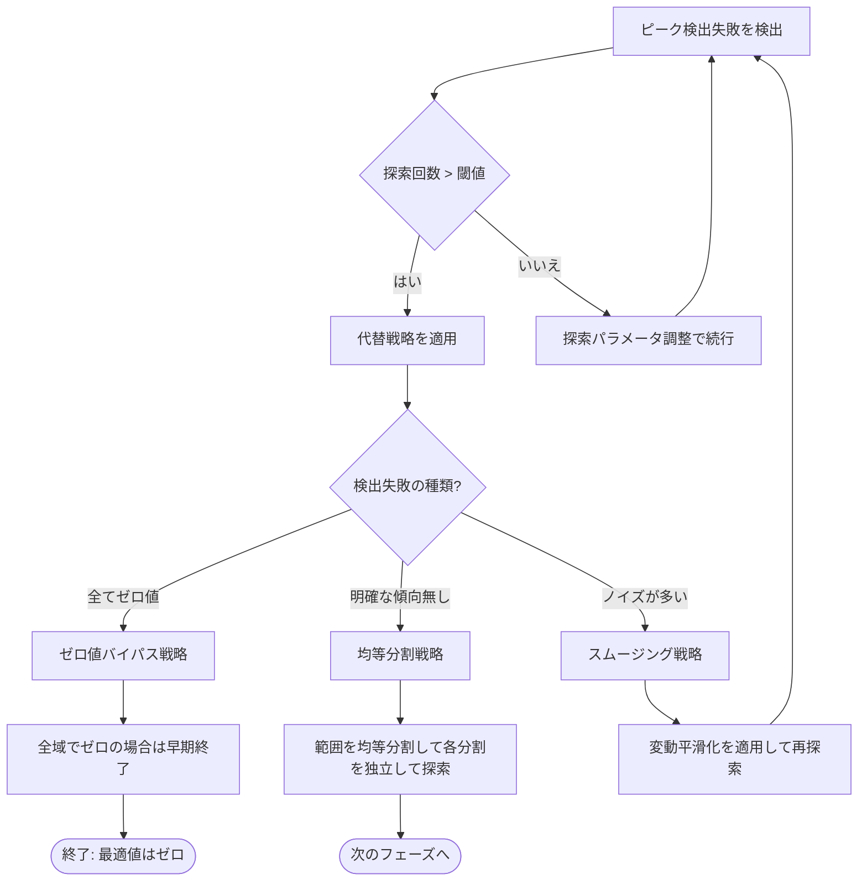
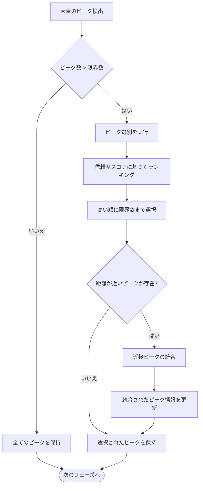
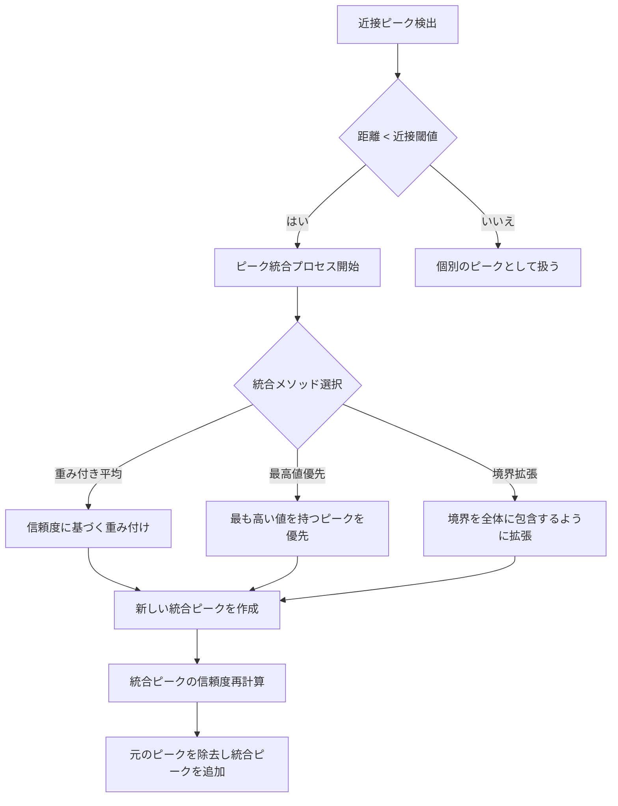

# エッジケース処理と特殊状況への対応

## 概要

最適化アルゴリズムは様々な入力パターンや特殊な状況に対してロバストである必要があります。このドキュメントでは、アルゴリズムが対応すべき主要なエッジケースと、それに対する対応戦略について説明します。

## 1. ピーク情報の管理と実装

ピーク情報の効率的な管理は、複数の局所的最大値を持つ関数での探索において重要です。

### 1.1 ピーク検出ロジック



### 1.2 ピーク情報の記録と更新

ピーク情報は以下の手順で記録・更新します：

1. **初期ピーク検出**：
   - 評価値が上昇から下降に転じた点をピーク候補として記録
   - 前後の点も評価して、本当にピークかどうかを確認
   - 確認されたピークは `Peak` 構造体として保存

2. **信頼度算出**：
   - ピークの高さ（評価値）
   - ピーク前後の傾斜の急峻さ
   - 周辺の評価点数
   - これらの要素を組み合わせて 0.0〜1.0 の信頼度を計算

3. **境界推定**：
   - ピークから左右に探索して、評価値が大幅に減少する点を見つける
   - 左右それぞれで見つかった点を境界として記録
   - 境界が見つからない場合は、探索範囲の制約から推定

4. **ピーク情報の更新**：
   - 探索が進むにつれて新たな情報が得られた場合、ピーク情報を更新
   - 特に境界推定値と信頼度は継続的に更新される可能性がある

## 2. 極端な入力範囲への対応

実际の探索では、非常に小さい範囲から非常に広い範囲まで、様々な入力範囲に対応する必要があります。

### 2.1 非常に小さい入力範囲の場合



小さい入力範囲の場合の対応戦略：

1. **間隔チェック**：
   - 範囲幅が予め設定した間隔閾値（例: 10）以下の場合
   - 全数値のため、小さい範囲では点数が非常に少ない

2. **全点評価**：
   - 範囲内の全ての整数点を直接評価
   - ピーク検出や黒金分割探索は必要ない

3. **最適化**：
   - 評価値の高い順にソートして最適値を即座に特定
   - 計算効率よりも完全な結果を優先

### 2.2 非常に広い入力範囲の場合



広い入力範囲の場合の対応戦略：

1. **分割式探索**：
   - 非常に広い範囲（例: > 10,000）を複数のサブ範囲に分割
   - 等間隔分割または平方根スケールの分割を適用

2. **酷似探索**：
   - 各サブ範囲に対して「手掩き探索」を実行
   - 数点のサンプリングにより、各サブ範囲のポテンシャルを推定

3. **加速化戦略**：
   - パーセンタイルベースのサンプリングにより売切りの悪い常塘を早期に排除
   - 評価値の分布パターンから有望なサブ範囲を特定

4. **適応的サンプリング**：
   - 初期は簡略探索で大まかな分布を確認
   - 高い評価値が見つかった領域でサンプリング密度を上げる

## 3. ピーク検出失敗時の代替戦略

ピーク検出アルゴリズムが変化の積極的なパターンを見つけられない場合、代替戦略を適用します。



### 3.1 代替戦略の種類

状況に応じて以下の戦略を適用します：

1. **全てゼロ値の場合**：
   - 評価結果が全てゼロ値の場合
   - ゼロ値バイパス戦略：最小入力値を倍増させてスキップサンプリング
   - 一定回数後もゼロのみなら早期終了（結果はゼロ）

2. **明確な傾向が見られない場合**：
   - 均等分割戦略を適用
   - 探索範囲をN等分割（通常は3〜5分割）
   - 各分割を独立した探索範囲として扱い、フェーズ2に渡す

3. **ノイズが多いデータの場合**：
   - 移動平均や中央値フィルターなどのスムージング手法を適用
   - 平滑化されたデータで再度ピーク検出を試みる
   - 上昇率の閾値を調整して注目すべき変化点の感度を下げる

### 3.2 代替戦略の実装ポイント

```rust
// ピーク検出失敗時の代替戦略クラス
pub struct FallbackStrategy {
    max_exploration_count: usize,
    fallback_type: FallbackType,
    smoothing_window_size: usize,
    equal_division_count: usize,
}

pub enum FallbackType {
    ZeroBypass,
    EqualDivision,
    Smoothing,
}

impl FallbackStrategy {
    // 代替戦略を選択し実行するメソッド
    pub fn apply(&self, evaluator: &mut CachedEvaluate, range: (M, M)) -> Vec<PromisingInterval> {
        match self.fallback_type {
            FallbackType::ZeroBypass => self.apply_zero_bypass(evaluator, range),
            FallbackType::EqualDivision => self.apply_equal_division(evaluator, range),
            FallbackType::Smoothing => self.apply_smoothing(evaluator, range),
        }
    }
    
    // 実装詳細は省略...
}
```

代替戦略は、通常のピーク検出アルゴリズムが失敗した場合のセーフティネットとして機能します。これにより、様々な入力パターンに対してもアルゴリズムが完全に失敗することなく、何らかの結果を返せるようにします。

## 4. 多すぎるピーク検出時の選別方法

複数の局所的最大値が存在する場合、ピーク検出アルゴリズムは大量のピーク候補を検出する可能性があります。この場合、選別が必要です。



### 4.1 信頼度スコアに基づく選別

ピークの選別は以下の要素を考慮した信頼度スコアに基づいて行われます：

1. **ピークの高さと逆転動作**：
   - 評価値が高いピークほど高わスコア
   - 上昇から下降への逆転が明確なほど高スコア

2. **平均との降差**：
   - 全体の平均値よりも大きく離れた値を持つピークほど高スコア
   - 周囲との差が大きいほど高スコア

3. **ピークの頭の尖り具合**：
   - 尖った山型のピークは低スコア
   - 穴のような急升降も低スコア
   - 穏やかで自然な山型が高スコア

### 4.2 近接ピークの統合方法

探索中に近接した複数のピークが検出されることがあります。この場合、ピーク情報を統合して探索効率を高める必要があります。



#### 近接ピークの判定基準

1. **距離に基づく判定**：
   - ピーク間の距離が設定された閾値（例: 10〜20の間隔）以下
   - 閾値は入力データの特性やスケールに応じて調整する

2. **境界重複性の考慮**：
   - 各ピークの付随する境界情報が大きく重複
   - 重複率が高い（例: 50%以上）場合に統合候補とする

#### 統合プロセスの詳細

1. **重み付き平均による統合**：
   - 各ピークの信頼度を重みとして使用
   - 新しいピークの位置 = Σ(信頼度_i * 位置_i) / Σ信頼度_i
   - 新しいピークの値 = Σ(信頼度_i * 値_i) / Σ信頼度_i

2. **境界の統合**：
   - 統合後の左境界 = min(全ての左境界)
   - 統合後の右境界 = max(全ての右境界)
   - ただし、信頼度が低いピークの境界は重み付けを下げて考慮

3. **信頼度の統合方法**：
   - 最も単純な方法: 統合後信頼度 = max(全ての信頼度)
   - 高度な方法: 統合後信頼度 = 1 - Π(1 - 信頼度_i)
   - 実用的な方法: 統合後信頼度 = (Σ信頼度_i) / 統合ピーク数
