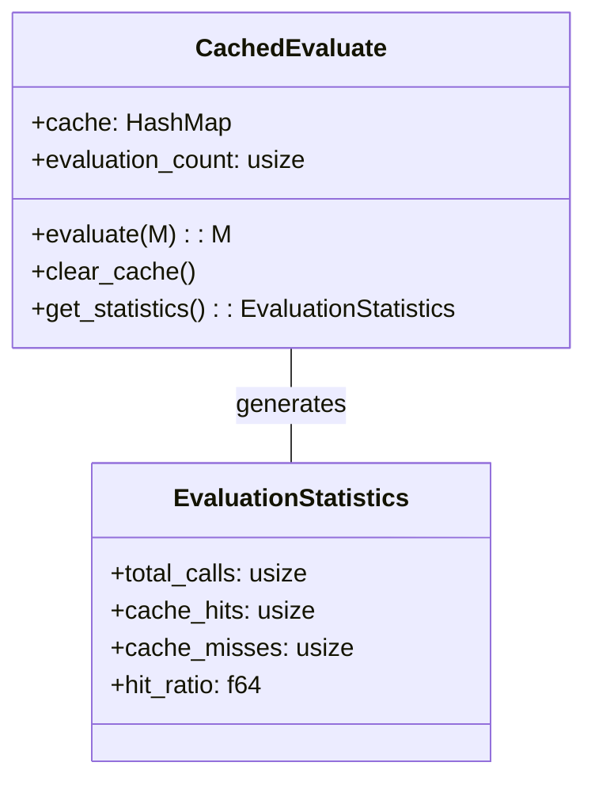
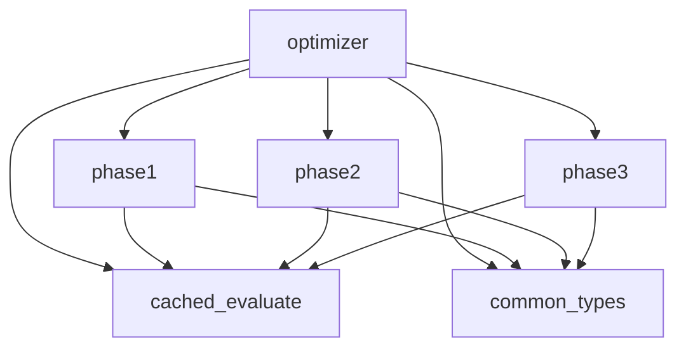
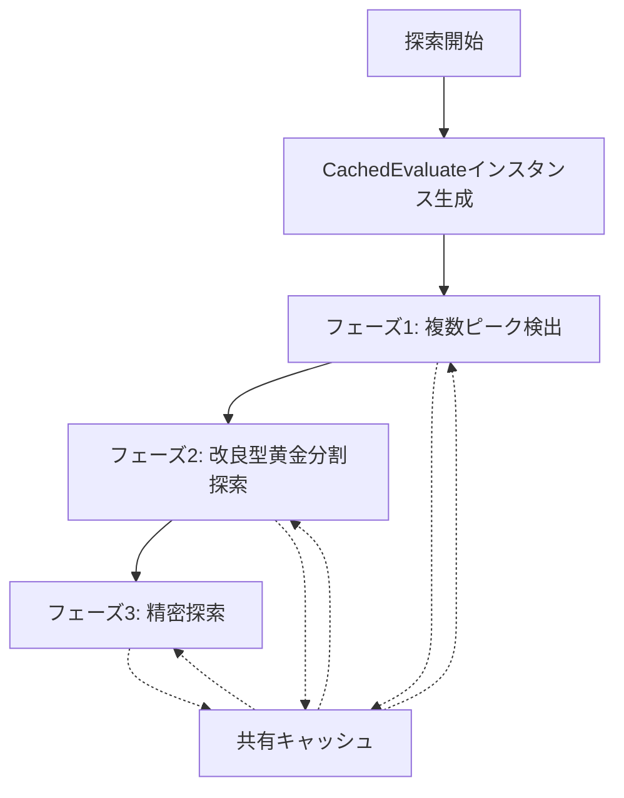

# 最適化アルゴリズムの実装詳細

## モジュール構成と技術的詳細

このドキュメントでは、最適化アルゴリズムを実装する際の具体的な技術的詳細について説明します。特に評価関数のキャッシング戦略やモジュール構成など、実装上重要なポイントを記載しています。

## 1. CachedEvaluateモジュール

評価関数の呼び出しコストを最小化するため、キャッシング機能を持つ評価モジュールを実装します。



### 機能詳細

1. **キャッシュ管理**:
   - 入力値と出力値のマッピングを保持するハッシュマップ
   - 既に評価済みの入力値に対しては再計算せずキャッシュから返却
   - 新しい入力値に対してのみ実際の評価関数を呼び出し

2. **統計情報収集**:
   - 評価関数の総呼び出し回数
   - キャッシュヒット回数とミス回数
   - ヒット率の計算（性能評価指標）

3. **実装例**:

```rust
pub struct CachedEvaluate {
    cache: HashMap<M, M>,
    evaluation_count: usize,
}

impl CachedEvaluate {
    pub fn new() -> Self {
        Self {
            cache: HashMap::new(),
            evaluation_count: 0,
        }
    }
    
    pub fn evaluate(&mut self, input: M) -> M {
        // キャッシュにある場合はそれを返す
        if let Some(&result) = self.cache.get(&input) {
            return result;
        }
        
        // キャッシュにない場合は評価関数を呼び出す
        self.evaluation_count += 1;
        let result = self.actual_evaluate(input);
        
        // 結果をキャッシュに保存
        self.cache.insert(input, result);
        
        result
    }
    
    fn actual_evaluate(&self, input: M) -> M {
        // 実際の評価関数の呼び出し（関数特性による実装）
        // この例では単純化のためにプレースホルダー
        // ...
    }
    
    pub fn get_statistics(&self) -> EvaluationStatistics {
        let total_calls = self.evaluation_count;
        let cache_hits = self.cache.len();
        let cache_misses = total_calls - cache_hits;
        let hit_ratio = if total_calls > 0 {
            cache_hits as f64 / total_calls as f64
        } else {
            0.0
        };
        
        EvaluationStatistics {
            total_calls,
            cache_hits,
            cache_misses,
            hit_ratio,
        }
    }
}
```

## 2. サブモジュール構成

最適化アルゴリズムは、以下のサブモジュールに分割して実装します。



### モジュール詳細

1. **common_types**:
   - 共通のデータ型と定数を定義
   - M（入力値型）、Peak、PromisingInterval構造体など

2. **cached_evaluate**:
   - 評価関数のキャッシング機能を実装
   - 統計情報収集メカニズムを提供

3. **phase1**:
   - 複数ピーク検出と有望区間特定の実装
   - 指数的探索アルゴリズム

4. **phase2**:
   - 改良型黄金分割探索の実装
   - 複数区間の独立探索機能

5. **phase3**:
   - 精密探索アルゴリズムの実装
   - 境界近傍の詳細探索機能

## 3. キャッシング戦略の詳細

評価関数の呼び出しを最小化するためのキャッシング戦略には以下の特徴があります：

### グローバルキャッシュとフェーズ間共有



### 最適化ポイント

1. **重複評価の排除**:
   - 異なるフェーズ間で同じ入力値に対する評価を共有
   - 特に有望区間の境界付近で重複評価が発生しやすいため効果的

2. **メモリ使用量の管理**:
   - 探索範囲が非常に広い場合、選択的キャッシングの実装
   - 特定の範囲や重要な点のみをキャッシュに保持

3. **キャッシュクリア戦略**:
   - 長時間の探索でメモリ使用量が増大する場合
   - 使用頻度の低いキャッシュエントリの選択的削除

## 4. 共通型の定義

アルゴリズム全体で使用される主要な型と構造体を定義します。

```rust
// 入力と出力の型（整数を想定）
pub type M = i64;

// ピーク情報を管理する構造体
pub struct Peak {
    pub position: M,         // ピークの位置
    pub value: M,            // ピークでの評価値
    pub left_bound: M,       // 左側の推定境界
    pub right_bound: M,      // 右側の推定境界
    pub confidence: f64,     // このピークの信頼度（0.0〜1.0）
}

// 有望な探索区間を表す構造体
pub struct PromisingInterval {
    pub lower_bound: M,      // 区間の下限値
    pub upper_bound: M,      // 区間の上限値
    pub estimated_peak_position: M,  // 推定されるピーク位置
    pub peak_value: M,       // 観測された最高評価値
    pub left_slope: f64,     // 左側の傾き情報
    pub right_slope: f64,    // 右側の傾き情報
    pub evaluation_count: usize, // この区間での評価回数
    pub priority_score: f64, // 優先度スコア
}

// 探索パラメータを管理する構造体
pub struct ExplorationParams {
    pub growth_factor: M,    // 指数探索の成長率
    pub min_peaks_to_find: usize, // 最小ピーク検出数
    pub max_peaks_to_find: usize, // 最大ピーク検出数
    pub min_peak_distance: M, // ピーク間の最小距離
    pub confidence_threshold: f64, // ピーク信頼度の閾値
}
```

## 5. コンポーネント間インターフェース

各フェーズ間のデータの受け渡しを明確に定義します。

### フェーズ1からフェーズ2へ

```rust
// フェーズ1の出力とフェーズ2の入力
pub struct Phase1Output {
    pub promising_intervals: Vec<PromisingInterval>,
    pub evaluation_stats: EvaluationStatistics,
}

// フェーズ1の関数シグネチャ
pub fn phase1_multiple_peak_detection(
    min_input: M,
    max_input: M,
    params: &ExplorationParams,
    evaluator: &mut CachedEvaluate,
) -> Phase1Output {
    // 実装...
}
```

### フェーズ2からフェーズ3へ

```rust
// フェーズ2の出力とフェーズ3の入力
pub struct Phase2Output {
    pub refined_intervals: Vec<RefinedInterval>,
    pub global_best: (M, M), // (位置, 評価値)
    pub evaluation_stats: EvaluationStatistics,
}

pub struct RefinedInterval {
    pub lower_bound: M,
    pub upper_bound: M,
    pub best_position: M,
    pub best_value: M,
}

// フェーズ2の関数シグネチャ
pub fn phase2_golden_section_search(
    promising_intervals: Vec<PromisingInterval>,
    evaluator: &mut CachedEvaluate,
) -> Phase2Output {
    // 実装...
}
```

## 6. エラー処理と回復戦略

探索中に発生する可能性のある問題に対処するための戦略を定義します。

1. **無効な入力範囲の処理**:
   - 入力範囲が無効（最小値 > 最大値など）の場合のフォールバック
   - デフォルト値の設定とエラーログの記録

2. **ピーク検出失敗時の代替戦略**:
   - フェーズ1でピークが検出できない場合、入力範囲を均等分割
   - 広域の一様サンプリングによる代替探索

3. **収束失敗時の対応**:
   - 最大反復回数に達しても収束しない場合の早期終了
   - 最良の中間結果を保存して返却

これらの技術的詳細をアルゴリズム実装時の参考として活用することで、効率的かつ堅牢な最適化アルゴリズムの実装が可能になります。
