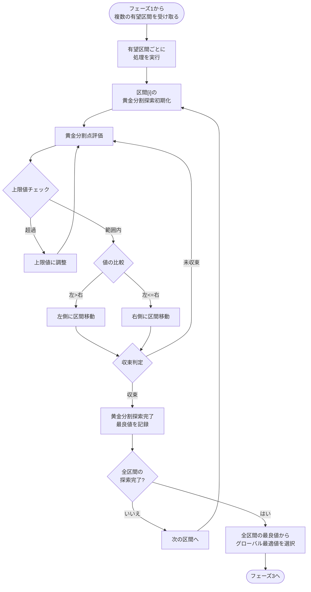
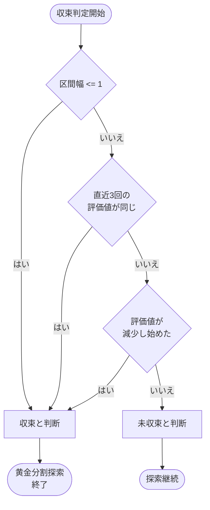

# フェーズ2: 改良型黄金分割探索アルゴリズム

## 複数の局所的最大値に対応する黄金分割探索

フェーズ2では、フェーズ1で特定された複数の有望区間それぞれに黄金分割探索を適用し、合計関数の最適値を効率的に発見します。特に「単調増加後に突然ゼロになる」という特性を持つ合計関数に対して効果的です。



## 改良型黄金分割探索の主要特徴

1. **複数区間の独立探索**
   - フェーズ1で特定された各有望区間に対して独立した黄金分割探索を実行
   - 各区間の特性（単調増加、急激な変化点など）に応じた探索

2. **黄金比による効率的な点選定**
   - 黄金比（約0.618）を使って効率的に探索点を選定
   - 区間を常に黄金比で分割し、最小限の評価で狭い範囲に収束

3. **急激な変化点検出と対応**
   - 連続する評価点の値の変化を監視
   - 急激な変化が検出された場合、その区間の中間点も評価して精度を向上

4. **シンプルな収束判定**
   - 区間幅が1以下（整数値の最小単位）
   - 直近の評価値が安定（同じ値が複数回続く）
   - 評価値が減少し始めた（最大値を過ぎた）

5. **グローバル最適値の選択**
   - 全ての区間探索が完了したら、最も評価値の高い解をグローバル最適値として選択

## 収束判定の詳細フローチャート



## 収束判定の具体的条件

### 1. 区間幅による判定
区間内の整数点が1つ以下になったら、これ以上の探索は不要です。整数の世界では区間幅が1以下になると、探索すべき新たな整数点が存在しません。

```rust
if right - left <= 1 {
    return true; // 収束
}
```

### 2. 連続評価値による判定
直近の評価結果が全て同じ値を示した場合、収束していると判断できます。

```rust
if last_values.len() >= 3 && 
   last_values.iter().all(|&val| val == last_values[0]) {
    return true; // 収束
}
```

### 3. 値の減少による判定
評価値が減少し始めた場合は、最大値を過ぎたと判断できます。

```rust
if current_value < previous_value {
    return true; // 収束（最大値を過ぎた）
}
```

## フェーズ2の実装ステップ

1. フェーズ1から複数の有望区間を受け取る
2. 各有望区間に対して独立した黄金分割探索を実行
   - 黄金比を使った区間分割と評価
   - 急激な変化点の検出と対応
   - 収束判定による探索終了
3. 全区間の探索結果から最も評価値の高い解を選択
4. 最適解とその周辺区間をフェーズ3に渡す

## フェーズ2の出力
フェーズ2の結果として、グローバル最適値の周辺の狭い区間 `(refined_lower, refined_upper)` と、その区間内で発見された最良の評価点をフェーズ3に渡します。
