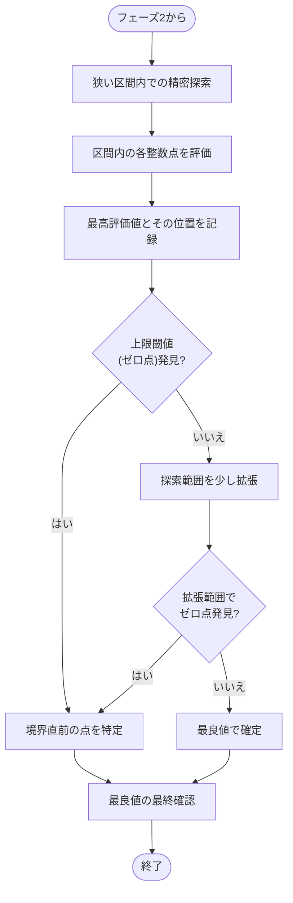
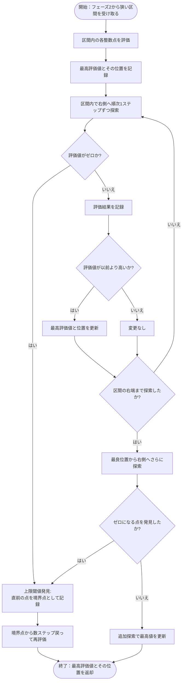

# フェーズ3: 精密探索アルゴリズム

## 精密探索の概要

フェーズ3は、フェーズ2の黄金分割探索によって狭められた範囲内で、最大値をより精密に探索するためのフェーズです。特に、上限閾値（ゼロに落ちる境界）近傍を重点的に調査します。

## シンプルな精密探索アルゴリズム

フェーズ3では、以下のシンプルな手順で精密探索を行います：

1. フェーズ2から受け取った狭い区間内（通常は幅が小さい）の整数点を順次評価します
2. 評価しながら最高評価値とその位置を常に記録します
3. 評価値がゼロになる点（上限閾値）を発見した場合、その直前の点を「境界点」として特に注目します
4. 区間内で上限閾値が見つからない場合は、少し探索範囲を拡張して上限閾値を探します

## 詳細アルゴリズム

## 終了条件

フェーズ3の探索は、以下のいずれかの条件が満たされた時点で終了します：

### 1. 上限閾値の発見
評価値がゼロになる点を見つけた場合、その直前の点が上限閾値の直前と判断します。この点を境界点として記録し、境界点の周辺数点を再評価した後に探索を終了します。

### 2. 区間全体の探索完了
与えられた区間内のすべての整数点を評価し終えた場合、探索範囲をわずかに拡張して上限閾値を探します。拡張範囲でも上限閾値が見つからない場合は、最高評価値を持つ点で探索を終了します。

### 3. 再評価と最終確認
上限閾値が見つかった場合、境界点から数ステップだけ戻った点も評価して、境界近くでの最適値を正確に把握します。これにより、最終的な最良値と、1ステップ先がゼロになる境界点を正確に特定します。

### 4. 結果返却
探索プロセス全体を通じて見つかった最高評価値とその位置を最終結果として返却します。
