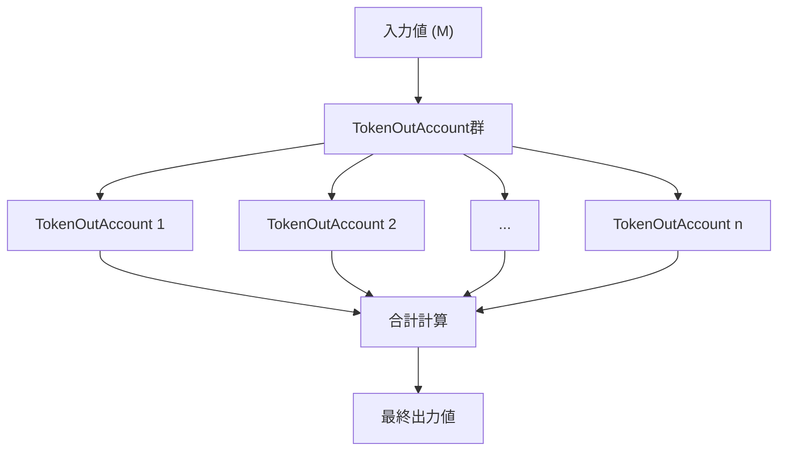
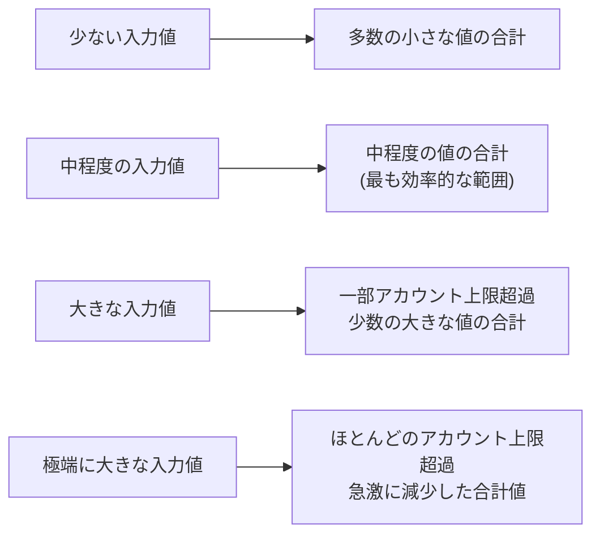

# 合計関数の特性と挙動

## 合計関数の基本構造

この最適化アルゴリズムが対象とする合計関数は、以下の特性を持ちます：



### 基本メカニズム

1. **TokenOutAccountシステム**:
   - 入力値 M は複数のTokenOutAccountに渡されます
   - 各TokenOutAccountは独自の計算式で出力値を生成します
   - 最終的な出力値は、各TokenOutAccountの返値の合計となります

2. **上限値システム**:
   - 各TokenOutAccountには入力上限があります
   - 入力値がその上限を超えると、そのアカウントは出力としてゼロを返します
   - これにより合計値は入力値の増加に対して非線形的に変化します

## 入力値による挙動の変化

合計関数の出力値は、入力値の大きさに応じて以下のように変化します：



### 各領域の特性

1. **少ない入力値の領域**:
   - ほぼすべてのTokenOutAccountが出力値を生成
   - 出力値は比較的小さいが、数が多いため合計値は緩やかに増加

2. **中程度の入力値の領域**:
   - 効率的な出力を生成するTokenOutAccountが多数存在
   - この領域に最大値が存在する可能性が高い

3. **大きな入力値の領域**:
   - 一部のTokenOutAccountが上限を超え、出力値がゼロに
   - 残りのアカウントが大きな値を出力するため、合計値はまだ高い水準

4. **極端に大きな入力値の領域**:
   - 大多数のTokenOutAccountが上限を超えゼロを返す
   - 合計値は急激に減少し、最終的にはほぼゼロに近づく

## 予測される合計関数の形状

```mermaid
xychart-beta
    title "入力値と出力合計値の関係"
    x-axis "入力値" [0, 10, 20, 30, 40, 50, 60, 70, 80, 90, 100]
    y-axis "出力合計値" 
    line [0, 2, 8, 20, 35, 42, 30, 15, 5, 2, 0]
    annotation 40, 42 "最大値"
    annotation 60, 30 "急減少開始"
```

### 合計関数の予測される挙動パターン

- 初期段階で徐々に増加
- 中間段階で比較的急速に増加
- ピーク領域で最大値または複数の局所的最大値
- その後、TokenOutAccountが除外されるにつれて減少
- 最終的にはほぼゼロに近づく

## 最適化アルゴリズムへの影響

合計関数のこのような特性は、最適化アルゴリズムの設計に以下の影響を与えます：

1. **複数の局所的最大値の可能性**:
   - 複数のピークを検出できるアルゴリズムが必要
   - 各ピークを独立して評価するアプローチが効果的

2. **急激な変化点への対応**:
   - 値が急激に変化する点の検出が重要
   - 特に上限閾値（ゼロに落ちる点）の直前を精密に探索する必要性

3. **広範囲探索と精密探索のバランス**:
   - 初期段階では広い範囲を効率的に探索
   - 有望区間が特定された後は精密な探索に切り替え
