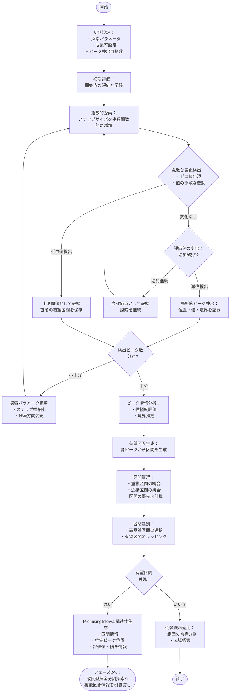
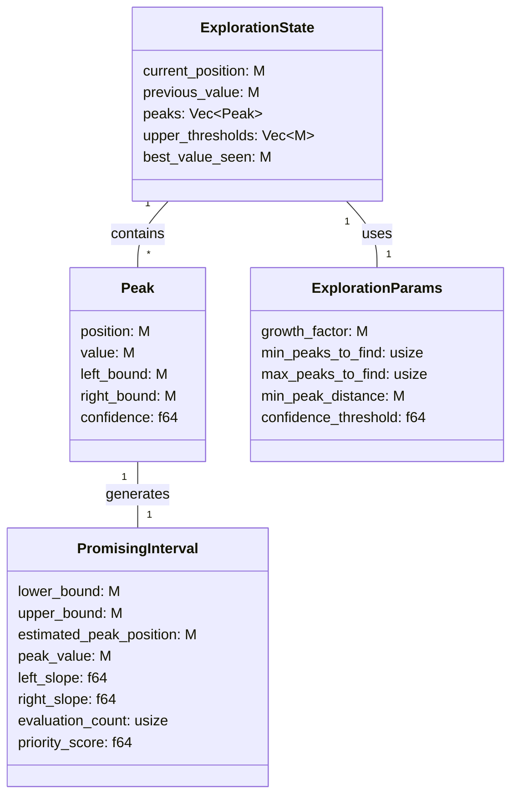
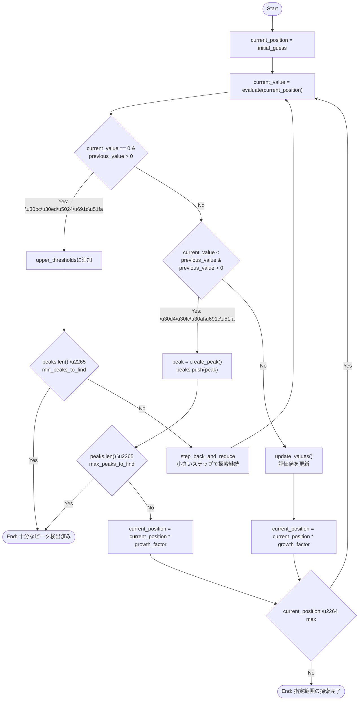

# フェーズ1: 複数ピーク検出と有望区間特定

## 目的と概要

このフェーズでは、複数の局所的最大値（ピーク）が存在する可能性のある関数において、有望な探索区間を効率的に特定します。フェーズ2の改良型黄金分割探索に適切な入力を提供することが主目的です。

### 対象とする関数の特性
- 入力が小さすぎる場合は出力値がゼロ
- その後、出力値が単調増加するが増加率は徐々に変化
- 複数の局所的最大値（ピーク）が存在する可能性がある
- 特定の入力値を超えると出力が急激に減少または突然ゼロになる
- 入力には上限値が存在する

### フェーズ1の役割
- 高速かつ効率的に複数のピークを検出
- 各ピーク周辺の有望区間を特定・評価
- 複数の区間を必要に応じて統合・選別
- フェーズ2に最適な探索区間情報を提供

## アルゴリズムの全体構造

複数の局所的最大値を持つ関数に対応するため、探索プロセスを以下のフローで設計しています。

### アルゴリズムの主要ステップ

1. **探索準備と初期化**
   - 探索パラメータ（成長率、検出目標ピーク数、信頼度閾値）の設定
   - データ構造の初期化（ピーク情報、探索状態管理）

2. **複数ピーク検出プロセス**
   - 指数的ステップサイズによる広域探索
   - 評価値変化の監視による局所的ピークと急激変化点の検出
   - 上限閾値（評価値ゼロ）の検出と記録
   - 複数ピークの位置・評価値・範囲の記録

3. **有望区間管理システム**
   - 各ピークに基づく有望区間の生成
   - 重複または近接する区間の統合処理
   - 区間品質評価（ピーク値、範囲幅、傾斜情報に基づく）
   - 上位区間の選別または複数区間情報の生成

4. **フェーズ2への橋渡し**
   - 複数の局所的最大値に対応するための区間情報構築
   - 各区間の特性（予測ピーク位置、境界情報、傾き）の詳細化
   - 探索リソース配分のための区間優先度付け

## 詳細なアルゴリズム設計

### 1. 探索の初期化とデータ構造

フェーズ1では、複数の局所的最大値を効率的に検出し、その情報を管理するためのデータ構造と探索パラメータを設計します。

#### 主要なデータ構造

#### 主要データ構造の説明

1. **Peak（ピーク情報）**
   - `position`: ピークの位置値
   - `value`: その位置での評価値
   - `left_bound`/`right_bound`: ピークの推定境界
   - `confidence`: このピークの信頼度スコア（値の大きさや変化率に基づく）

2. **PromisingInterval（有望区間）**
   - `lower_bound`/`upper_bound`: 区間の下限と上限
   - `estimated_peak_position`: 推定されるピークの位置
   - `peak_value`: 検出された最高評価値
   - `left_slope`/`right_slope`: 区間の左右の傾き情報
   - `priority_score`: この区間の優先度スコア

3. **ExplorationState（探索状態）**
   - `current_position`: 現在の探索位置
   - `previous_value`: 前回評価値・変化検出用
   - `peaks`: 検出したピークのリスト
   - `upper_thresholds`: 検出した上限閾値（ゼロになる点）

4. **ExplorationParams（探索パラメータ）**
   - `growth_factor`: 指数探索の成長率（通常は2）
   - `min_peaks_to_find`/`max_peaks_to_find`: 検出するピーク数の間値
   - `min_peak_distance`: ピーク間の最小距離（近すぎるピークを統合）
   - `confidence_threshold`: ピークを有効と判断する信頼度閾値

#### フェーズ2との連携ポイント

フェーズ1では、フェーズ2の改良型黄金分割探索に適した形で有望区間情報を生成します。具体的には：

- 複数の独立した`PromisingInterval`を生成し、各区間の特性情報を付与
- 区間の優先度に基づき、フェーズ2での探索リソース配分を容易にする
- 評価関数の呼び出し回数を最小化するための評価キャッシュを共有

### 2. 複数ピーク検出の指数的探索アルゴリズム

このセクションでは、フェーズ1の中核となる指数的探索による複数ピーク検出アルゴリズムについて説明します。このアルゴリズムは、広範囲を高速に探索しながら複数の局所的最大値（ピーク）を検出し、それらを記録します。

#### 指数的探索の流れ

ピーク検出のアルゴリズムは以下のフローで実行されます。

このフローチャートは、指数的探索による複数ピーク検出の基本的な流れを示しています。検出プロセスは開始位置から指数的に増加するステップサイズで探索を進め、評価値の変化に基づいてピークや上限閾値を検出します。

#### 指数的ピーク検出の主要ステップ

指数的探索アルゴリズムは以下のステップから構成されています：

1. **初期化と探索開始**
   - 開始位置と成長率（通常は2）を設定
   - 開始位置の評価値を計算し初期ベースラインとして記録

2. **指数的なステップでの探索**
   - 現在位置から指数的に増加する距離で次の探索点を設定
   - 各探索点での評価値を計算し記録
   - 評価値の変化パターンを追跡し分析

3. **ピーク検出と記録**
   - 現在の評価値が前回より低下した場合、前回の位置を局所的ピークとして検出
   - 各ピークの位置、評価値、推定される境界をPeak構造体として記録
   - ピークの信頼度を評価値や変化率に基づいて計算

4. **上限閾値の検出**
   - 評価値がゼロになり、前回の評価値が正だった場合、上限閾値として検出
   - 上限閾値の直前の区間を有望区間として記録
   - 必要に応じて、上限閾値付近をより細かいステップで再探索

5. **探索終了条件の確認**
   - 指定された最小数のピークを検出した場合に探索終了
   - 最大数のピークを検出した場合に探索終了
   - 探索範囲の上限に達した場合に探索終了

#### 指数的探索の特徴と利点

指数的探索は以下の特徴と利点を持ちます：

1. **広範囲の高速探索**
   - ステップサイズを指数的に増加させることで、広い範囲を少ないステップ数で探索可能
   - 評価関数の呼び出し回数を最小限に抑えることが可能

2. **複数のピーク検出能力**
   - 一次の探索で複数の局所的ピークを検出可能
   - 各ピークの情報を記録し管理することで、後続の探索に活用

3. **急変点検出機能**
   - 関数値が突然ゼロになるような急変点を効率的に検出
   - ゼロ値検出時には、より細かいステップサイズで再探索を行う適応性

#### 特殊なケースの処理

指数的探索アルゴリズムは、以下の特殊なケースにも対応します：

1. **上限閾値検出時の縦小ステップ探索**
   - ゼロ値・上限閾値を検出した場合、直前の点と閾値の中間点で再探索
   - `step_back_and_reduce`関数を用いて、前の点からより小さいステップで探索を続行
   - これにより上限閾値付近の最適値をより正確に検出

2. **ピーク間距離の管理**
   - ピーク間の距離を追跡し、近すぎるピークが検出された場合は統合を検討
   - `min_peak_distance`パラメータを用いて最小ピーク間距離を設定
   - 近接したピークの場合、信頼度や評価値に基づいて統合または選択

#### 評価値の変化パターンと判断

指数的探索は、探索中に見られる評価値の変化パターンに基づいて重要な判断を行います：

1. **上昇パターン**
   - 評価値が続けて上昇している場合
   - 判断: `current_value > previous_value`
   - 探索ステップを続行し、ピーク到達まで探索を続ける

2. **ピークパターン**
   - 評価値が上昇した後、減少するパターン
   - 判断: `current_value < previous_value && previous_value > 0`
   - 判断時の処理: 前回の位置をピークとして記録

3. **上限閾値パターン**
   - 評価値が正の値から突然ゼロになるパターン
   - 判断: `current_value == 0 && previous_value > 0`
   - 判断時の処理: 上限閾値として記録し、必要に応じてより細かいステップで再探索

4. **活発度判定パターン**
   - 連続した探索点間の評価値の変化率に基づく判断
   - 判断: `(current_value - previous_value) / previous_value > threshold`
   - 急上昇領域を検出した場合、より小さいステップでの探索を検討

5. **探索完了判定**
   - 以下の条件のいずれかが満たされた場合に探索を完了
   - 最小数のピーク検出条件: `peaks.len() ≥ min_peaks_to_find`
   - 最大数のピーク検出条件: `peaks.len() ≥ max_peaks_to_find`
   - 探索範囲の上限到達条件: `current_position > max`

#### アルゴリズムの実装と調整ポイント

指数的探索アルゴリズムを実装する上で重要な調整ポイントは以下の通りです：

1. **成長率の調整**
   - `growth_factor` パラメータは探索の速度と精度のバランスに影響
   - 大きな値（例: 4.0）: 高速な探索が可能だが精度は低下
   - 小さな値（例: 1.5）: 探索は遅いがより精密
   - 推奨値: 2.0～3.0 の間でバランスが良好

2. **ピーク検出数の調整**
   - `min_peaks_to_find`: 最低限必要なピーク検出数
   - `max_peaks_to_find`: 検出する最大ピーク数
   - 小さな値に設定すると探索が早期終了する場合がある
   - 大きな値に設定すると探索に時間がかかるが、より多くの候補の中から最適解を試せる

3. **最小ピーク間距離の設定**
   - `min_peak_distance`: ピーク間の最小距離の設定
   - 小さすぎると多くの類似ピークが検出され分析が複雑に
   - 大きすぎると近接した重要なピークを見通してしまう可能性

#### 実装上の工夫と注意点

指数的探索アルゴリズムを実装する際の重要な工夫と注意点は以下の通りです：

1. **評価結果のキャッシュ機構**
   - 評価関数の呼び出しが高コストな場合、キャッシュ機構は必須
   - 既に探索済みの位置を記録し、再評価を回避

2. **増分探索から応用可能**
   - 指数的探索と別に、拘束中の高級探索にも効果的
   - 既に探索した領域の周囲で明種的な増分探索を行うことも可能

3. **適応的ステップサイズの調整**
   - 探索進行中に得られた情報に基づいてステップサイズを動的に調整
   - 子細な変化をキャッチしたい領域では小さなステップサイズを使用
   - 変化が究めて小さい領域では大きなステップサイズで素早く探索

### 3. 複数の有効範囲候補の統合と選択

#### 有望区間（PromisingInterval）の概念

フェーズ1の主要な出力は、最も効率的な探索が期待できる「有望区間（PromisingInterval）」です。この有望区間は以下の要素で特徴づけられます：

- **下限値と上限値**: 探索すべき区間の境界
- **推定ピーク位置**: 区間内で最高値が予測される位置
- **ピーク値**: 検出されたピークの評価値
- **左右の傾き**: 区間内での関数の変化率の特性
- **信頼度**: 区間内に高い値が存在する確信度

検出した複数のピークから、最も有望な範囲または複数の範囲を選択・統合します。このプロセスは以下のステップで進行されます：

1. **各ピークからの有望区間の生成**
   - 検出された各ピークの位置を中心に、評価値に基づいて適切なマージンを設定
   - 各ピークの左右にマージンを適用し、有望な探索区間を生成

2. **上限閾値に基づく区間の生成**
   - 検出された上限閾値の直前を有望な区間として設定
   - 上限閾値から適切な距離を差し引いた位置を区間の下限として設定

3. **重複区間の統合**
   - 複数の有望区間が重複している場合、それらを統合してより大きな単一の区間に統合
   - **重複判定基準**: 一方の区間の上限値が他方の区間の下限値以上の場合（上限≥下限）、重複と判定
   - **近接区間判定**: 区間間の距離が設定した閾値より小さい場合、近接していると判定し統合候補とする
   - **統合プロセス**: 区間を下限値でソートし、連続した区間を順に統合判定
   - 統合時には最小の下限と最大の上限を新しい区間の境界として使用

4. **最適区間の選択**
   - 生成された区間を複数の評価基準に基づいて評価
   - **評価基準**:
     - **ピーク値**: 区間内で検出された最高評価値（高いほど高評価）
     - **区間幅**: 探索に必要なコスト（狭いほど高評価）
     - **信頼度**: ピーク検出の確かさや評価点数に基づく信頼性
     - **傾き情報**: 区間内の関数の変化率（急島型か積型か）
   - **選択戦略**:
     - **単一区間戦略**: 評価値が最も高い単一の区間のみを選択
     - **複数区間戦略**: 評価値上位N個の区間を選択し、フェーズ2で并行探索
     - **基準混合戦略**: 複数の評価基準を重み付けし統合スコアで選択

5. **特殊ケースの処理**
   - **ピーク検出失敗時**: 有望区間が見つからない場合の対応
     - 探索全体を単一の広い区間として返すバックアップ戦略
     - 程度を下げたピーク検出基準で再探索を試行
   - **極端に狭い入力範囲**: 即座にフェーズ2に進行
   - **極端に広い入力範囲**: 範囲を複数に分割して探索
   - **多すぎるピーク検出時**: 信頼度スコアに基づきピークの選別を実施
   - **上限閾値とピーク空間の重なり**: ピークの信頼度と閾値の明確さに基づいて優先度を判断

### 4. サブルーチンと補助関数

フェーズ1の探索プロセスを効率的に実行するための重要な補助関数群を以下に説明します：

1. **ピークの境界推定**
   - `estimate_left_bound`: ピーク位置と成長率から左側境界を推定
   - `estimate_right_bound`: ピーク位置と次の探索点から右側境界を推定

2. **探索位置の計算**
   - `previous_position`: 現在位置から成長率を用いて前の探索点を計算
   - `next_position`: 現在位置から成長率を用いて次の探索点を計算

3. **閾値検出後の適応探索**
   - `step_back_and_reduce`: 上限閾値を検出した後、より細かいステップサイズで前の正常値領域に戻る
   - 上限閾値付近の最適値を拘束ステップで探索

4. **区間管理関数**
   - `merge_overlapping_ranges`: 重複する区間を単一のより広い区間に統合
   - `calculate_margin`: ピーク値に基づいて探索マージンを計算

5. **評価関数**
   - `evaluate_range_quality`: 区間の質を評価し、複数区間の優先順位を決定
   - `select_best_ranges`: 最も有望な区間を選択し、フェーズ2に渡す準備を行う

## ピーク評価と範囲選択のヒューリスティック

1. **ピークの評価**:
   - ピークの高さ（評価値）
   - ピークの幅（左右の境界範囲）
   - 上限閾値からの距離

2. **範囲の品質評価基準**:
   - 範囲内の最高評価値
   - 範囲の幅（探索コスト）
   - 他の範囲との重複度

3. **最良範囲の選択戦略**:
   - 単一の最良範囲を選択
   - 評価基準に基づいて上位N個の範囲を選択
   - 全体をカバーする結合範囲を生成

## エッジケースと特殊状況の処理

1. **ピークが検出されない場合**:
   - 全体が単調増加の場合、上限値付近を重点的に探索
   - 全体がゼロの場合、より小さなステップで探索を再試行

2. **多数のピークが検出される場合**:
   - 一定数のピークを超えたら探索を終了
   - 最も高いピークのみを選択するか、クラスタリングを適用

3. **ピーク間の距離が非常に近い場合**:
   - 近接するピークを統合して単一のより広い範囲を形成
   - より高精度な探索でピーク間の詳細を調査

## フェーズ1からフェーズ2への橋渡し

フェーズ1で特定した有効範囲は以下のいずれかの形でフェーズ2（黄金分割探索）に渡されます：

1. 単一の最も有望な範囲のみを渡す
2. 複数の有望な範囲を個別に黄金分割探索にかける
3. 複数の範囲を統合した単一の大きな範囲を渡す

選択される方法は、検出されたピークの数、品質、および計算リソースに依存します。
