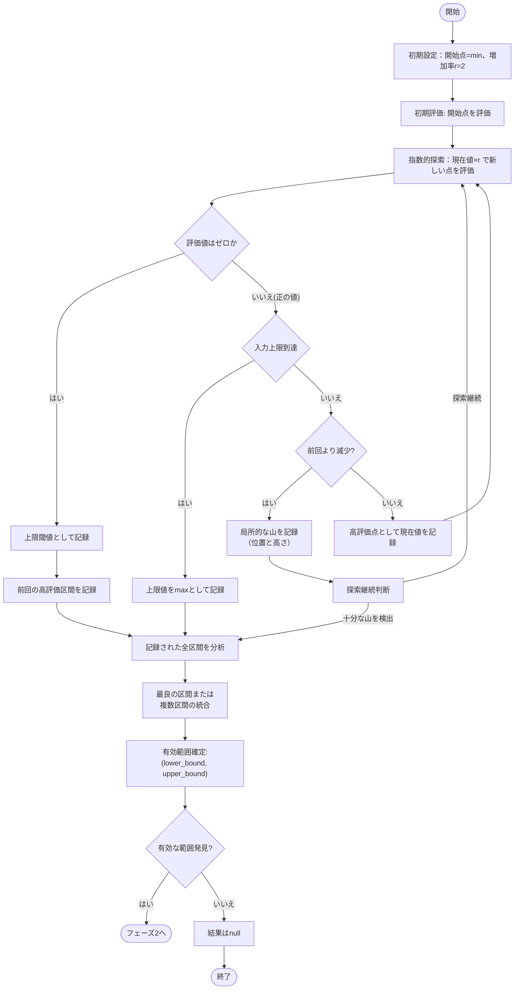

# フェーズ1: 有効範囲特定アルゴリズム

## 複数の局所的な山を考慮した有効範囲特定

このアルゴリズムは、以下の特性を持つ関数の有効範囲（最大値が存在する範囲）を効率的に特定します：
- 入力が小さすぎるとゼロ出力
- その後単調増加するが、増加率は徐々に低下
- 複数の局所的な山（局所最大値）が存在する可能性がある
- 最大値を超えると突然ゼロに落ちる
- 入力には最大値（上限）がある

## アルゴリズムの全体構造



## 詳細なアルゴリズム設計

### 1. 探索の初期化とパラメータ設定

```rust
// 探索パラメータの設定
struct ExplorationParams<M> {
    growth_factor: M,      // 指数的成長率（通常は2）
    min_peaks_to_find: usize, // 検出する最小ピーク数（例：3）
    max_peaks_to_find: usize, // 検出する最大ピーク数（例：5）
    min_peak_distance: M,  // ピーク間の最小距離
}

// 山（ピーク）情報の記録
struct Peak<M> {
    position: M,           // ピークの位置
    value: M,              // ピークの評価値
    left_bound: M,         // 左側の境界
    right_bound: M,        // 右側の境界
}

// 探索状態の追跡
struct ExplorationState<M> {
    current_position: M,   // 現在の探索位置
    previous_value: M,     // 前回の評価値
    peaks: Vec<Peak<M>>,   // 検出したピークのリスト
    upper_thresholds: Vec<M>, // 検出した上限閾値（ゼロに変わる位置）
    best_value_seen: M,    // これまでの最高評価値
}
```

### 2. 複数の山を検出する指数的探索

指数的な探索を継続し、複数の山（局所的な最大値）を検出します。

```rust
fn find_valid_range<A, M, C>(
    cache_eval: &CachedEvaluate<A, M, C>,
    min: M,
    initial_guess: M,
    max: M,
    params: ExplorationParams<M>
) -> Result<Vec<(M, M)>, InnerError>
where
    // ... 型パラメータの制約 ...
{
    let mut state = ExplorationState {
        current_position: initial_guess,
        previous_value: M::zero(),
        peaks: Vec::new(),
        upper_thresholds: Vec::new(),
        best_value_seen: M::zero(),
    };
    
    // 前回のピーク検出からの距離追跡
    let mut distance_from_last_peak = M::max_value();
    
    while state.current_position <= max {
        // 現在の点を評価
        let current_value = evaluate_point(cache_eval, state.current_position)?;
        
        // ゼロ値の検出（上限閾値）
        if current_value == M::zero() && state.previous_value > M::zero() {
            state.upper_thresholds.push(state.current_position);
            
            // 前のピークから十分な数を検出済みかチェック
            if state.peaks.len() >= params.min_peaks_to_find {
                break; // 十分なピークを検出済み
            }
            
            // 上限閾値後の探索継続（より小さいステップで）
            state.current_position = step_back_and_reduce(state.current_position, params.growth_factor);
            continue;
        }
        
        // ピーク（局所的な山）の検出
        if current_value < state.previous_value && state.previous_value > M::zero() {
            // 新しいピークの位置は前の点
            let peak_position = previous_position(state.current_position, params.growth_factor);
            
            // ピーク情報の記録
            let peak = Peak {
                position: peak_position,
                value: state.previous_value,
                left_bound: estimate_left_bound(peak_position, params.growth_factor),
                right_bound: state.current_position,
            };
            
            state.peaks.push(peak);
            distance_from_last_peak = M::zero();
            
            // 十分なピークを検出したか確認
            if state.peaks.len() >= params.max_peaks_to_find {
                break;
            }
        } else {
            // 評価値の更新と次の探索点への移動
            if current_value > state.best_value_seen {
                state.best_value_seen = current_value;
            }
            
            state.previous_value = current_value;
            distance_from_last_peak = distance_from_last_peak + step_size(state.current_position, params.growth_factor);
            state.current_position = state.current_position * params.growth_factor;
        }
    }
    
    // 検出したピークと上限閾値に基づいて有効範囲を決定
    determine_valid_ranges(state, min, max)
}
```

### 3. 複数の有効範囲候補の統合と選択

検出した複数のピークから、最も有望な範囲または複数の範囲を選択・統合します。

```rust
fn determine_valid_ranges<M>(
    state: ExplorationState<M>,
    min: M,
    max: M
) -> Result<Vec<(M, M)>, InnerError> {
    if state.peaks.is_empty() && state.upper_thresholds.is_empty() {
        // 有効な範囲が見つからない場合
        return Ok(vec![]);
    }
    
    let mut valid_ranges = Vec::new();
    
    // 各ピークに基づく範囲の設定
    for peak in &state.peaks {
        let margin = calculate_margin(peak.value);
        let lower = max(min, peak.position - margin);
        let upper = min(max, peak.position + margin);
        
        valid_ranges.push((lower, upper));
    }
    
    // 上限閾値に基づく範囲の設定
    for &threshold in &state.upper_thresholds {
        let margin = calculate_threshold_margin(threshold);
        let lower = max(min, threshold - margin);
        let upper = min(max, threshold);
        
        valid_ranges.push((lower, upper));
    }
    
    // 範囲の統合（必要に応じて）
    valid_ranges = merge_overlapping_ranges(valid_ranges);
    
    // 最も有望な範囲を選択
    if !valid_ranges.is_empty() {
        // 評価基準に基づいて並べ替え
        valid_ranges.sort_by(|a, b| evaluate_range_quality(a, b));
        
        // 最良の範囲を返すか、複数の有望な範囲を返す
        let best_ranges = select_best_ranges(valid_ranges);
        return Ok(best_ranges);
    }
    
    // バックアップ：最小から最大まで全範囲を返す
    Ok(vec![(min, max)])
}
```

### 4. サブルーチンと補助関数

```rust
// ピークの左側境界を推定
fn estimate_left_bound<M>(peak_position: M, growth_factor: M) -> M {
    peak_position / growth_factor
}

// 前の探索点を計算
fn previous_position<M>(current: M, growth_factor: M) -> M {
    current / growth_factor
}

// 上限閾値検出後に戻るステップ
fn step_back_and_reduce<M>(position: M, growth_factor: M) -> M {
    let previous = position / growth_factor;
    // 前の点と現在の点の間の中間点を計算
    previous + (position - previous) / M::from(2u128)
}

// 重複する範囲の統合
fn merge_overlapping_ranges<M>(ranges: Vec<(M, M)>) -> Vec<(M, M)> {
    if ranges.is_empty() {
        return ranges;
    }
    
    let mut sorted_ranges = ranges.clone();
    sorted_ranges.sort_by(|a, b| a.0.cmp(&b.0));
    
    let mut result = Vec::new();
    let mut current = sorted_ranges[0];
    
    for i in 1..sorted_ranges.len() {
        if sorted_ranges[i].0 <= current.1 {
            // 範囲が重複
            current.1 = max(current.1, sorted_ranges[i].1);
        } else {
            // 新しい非重複範囲
            result.push(current);
            current = sorted_ranges[i];
        }
    }
    
    result.push(current);
    result
}
```

## ピーク評価と範囲選択のヒューリスティック

1. **ピークの評価**:
   - ピークの高さ（評価値）
   - ピークの幅（左右の境界範囲）
   - 上限閾値からの距離

2. **範囲の品質評価基準**:
   - 範囲内の最高評価値
   - 範囲の幅（探索コスト）
   - 他の範囲との重複度

3. **最良範囲の選択戦略**:
   - 単一の最良範囲を選択
   - 評価基準に基づいて上位N個の範囲を選択
   - 全体をカバーする結合範囲を生成

## エッジケースと特殊状況の処理

1. **ピークが検出されない場合**:
   - 全体が単調増加の場合、上限値付近を重点的に探索
   - 全体がゼロの場合、より小さなステップで探索を再試行

2. **多数のピークが検出される場合**:
   - 一定数のピークを超えたら探索を終了
   - 最も高いピークのみを選択するか、クラスタリングを適用

3. **ピーク間の距離が非常に近い場合**:
   - 近接するピークを統合して単一のより広い範囲を形成
   - より高精度な探索でピーク間の詳細を調査

## フェーズ1からフェーズ2への橋渡し

フェーズ1で特定した有効範囲は以下のいずれかの形でフェーズ2（黄金分割探索）に渡されます：

1. 単一の最も有望な範囲のみを渡す
2. 複数の有望な範囲を個別に黄金分割探索にかける
3. 複数の範囲を統合した単一の大きな範囲を渡す

選択される方法は、検出されたピークの数、品質、および計算リソースに依存します。
