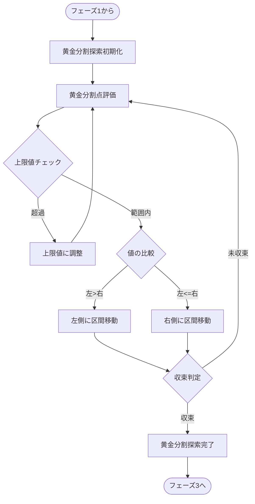
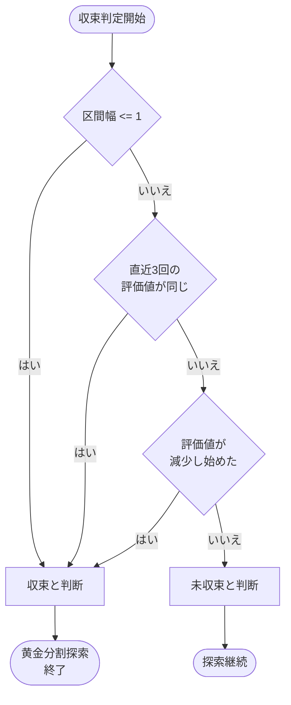

# フェーズ2: 黄金分割探索アルゴリズム

## 黄金分割探索の概要

黄金分割探索は、フェーズ1で特定された有効範囲内で最大値を効率的に見つけるための手法です。この手法は、関数が単調増加した後に突然ゼロになるという特性を持つ場合に特に有効です。



## 黄金分割探索による効率的探索

- 有効範囲内で黄金分割探索を適用
- 黄金比（約0.618）を使って効率的に探索点を選定
- 評価値に基づいて探索範囲を継続的に絞り込む
- 入力上限値を常にチェックし、必要に応じて調整
- 区間が十分に狭くなるか、評価値の変化が小さくなったら次のフェーズへ

## 収束判定の詳細フローチャート



## 収束判定に使用する条件

### 1. 区間幅による判定
区間内の整数点が1つ以下になったら、これ以上の探索は不要です。整数の世界では区間幅が1以下になると、その区間内に探索すべき新たな整数点が存在しません。

```rust
if right - left <= 1 {
    return true; // 収束
}
```

### 2. 連続評価値による判定
直近3回（または指定した回数）の評価結果が全て同じ値を示した場合、収束していると判断できます。これは特に、評価関数の出力が離散的な場合に有効です。

```rust
if last_values.len() >= 3 && 
   last_values.iter().all(|&val| val == last_values[0]) {
    return true; // 収束
}
```

### 3. 値の減少による判定
単調増加後に突然ゼロになる関数の特性を考慮すると、評価値が減少し始めた場合は、最大値を過ぎたか上限閾値に近づいている可能性があります。

```rust
if current_value < previous_value {
    return true; // 収束（または最大値を過ぎた）
}
```

## フェーズ2の出力
フェーズ2の結果として、次の探索フェーズに渡す狭められた区間 `(refined_lower, refined_upper)` を特定します。この区間内に最大値が高確率で存在し、次のフェーズでより精密な探索を行うための基盤となります。
