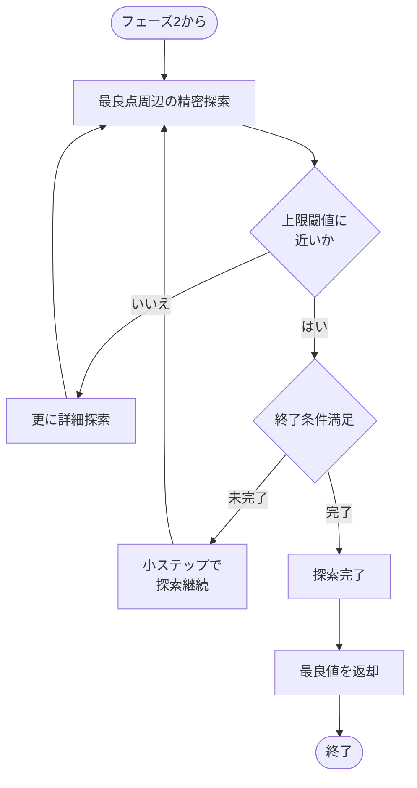
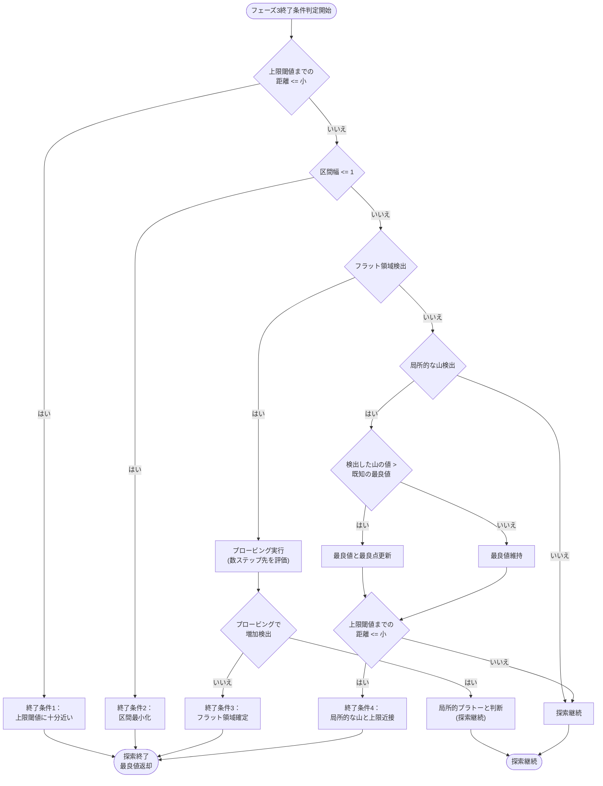

# フェーズ3: 精密探索アルゴリズム

## 精密探索の概要

フェーズ3は、フェーズ2の黄金分割探索によって狭められた範囲内で、最大値をより精密に探索するためのフェーズです。特に、上限閾値（ゼロに落ちる境界）近傍を重点的に調査します。

## 境界近傍の精密探索

- 前フェーズで見つけた最良点周辺を詳細に探索
- 特に上限閾値（ゼロに落ちる境界）の直前を重点的に調査
- 小さなステップサイズで慎重に探索
- 十分な精度が得られたら探索完了

## フェーズ3の詳細な終了条件フローチャート

## フェーズ3の終了条件詳細説明

### 1. 距離ベースの終了条件
- **上限閾値近接判定**：
  - 現在の探索点から上限閾値までの距離が「小」（3〜5程度）以下になった場合に探索を終了
  - 「上限閾値のすぐ手前まで探索した」と判断する条件

### 2. 評価値の変化パターンに基づく終了条件
- **フラット領域の検出**：
  - 直近5〜10点の評価値の変動幅が閾値以下、または傾きが十分に小さい場合にフラット領域と判定
  - フラット検出時にプロービング（数ステップ先の探索）を実施
  - プロービングで値の増加がなければ終了、増加があれば局所的プラトーと判断し探索継続

- **局所的な山の検出と処理**：
  - 連続する点で「増加→最大→減少」パターンを検出した場合、局所的な山として認識
  - 検出した山の値が既知の最良値より大きい場合は最良値を更新
  - 上限閾値までの距離が「小」以下なら探索終了、それ以外は探索継続

### 3. 探索範囲に基づく終了条件
- **区間最小化**：
  - 探索区間の幅が整数値の最小単位（1）以下になった場合に探索終了
  - 整数ドメインでは、これ以上細分化できないため自然な終了条件

### 4. 偶然性の排除とプラトー後の増加検出
- **偶然性の排除**：
  - 単一点での判断ではなく、複数点（5〜10点）での傾向を分析
  - 変動幅や傾きといった統計的指標を活用

- **プロービング戦略**：
  - フラット領域検出時に、数ステップ先の点を評価
  - 値が増加していれば局所的プラトーと判断し探索継続

### 5. 結果返却
- 探索中に記録された最良点の評価結果を返却
- 有効な値が見つからなかった場合はnullを返却
