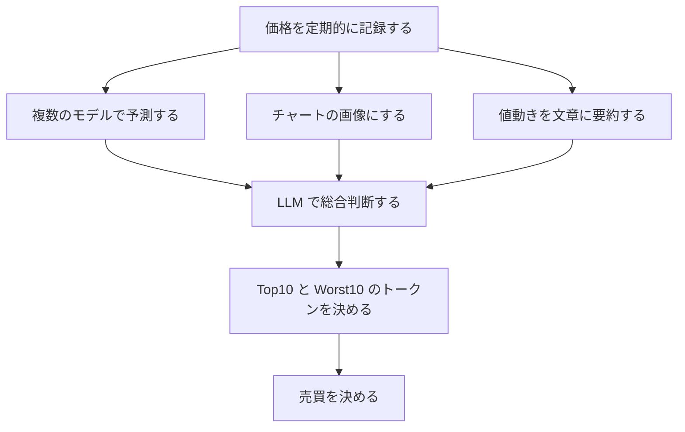

# トークンの価格を予測して売買する

## 流れ



## 価格予測モデル

次の2つのモデルで予測する。

| モデル | 特徴 |
| --- | --- |
| ARIMA | 為替の短期予測で実績がある。統計モデルの中で最もシンプルかつ信頼性が高い |
| LSTM | 複雑なトレンド・非線形な動きを捉えやすい。ARIMA では把握しにくい中期的なパターンも分析可能 |

それぞれのモデルでの予想を誤差とともに出力する。

## チャート画像

ローソクチャートにするか単純な折れ線にするか選択する。

## 値動きの要約

次のようなデータに変換してから LLM で要約させる

```text
2024-01-01のUSD/JPYは始値130.50円、終値130.80円、高値131.00円、安値130.30円で、前日比nan%でした。
2024-01-02のUSD/JPYは始値130.80円、終値131.20円、高値131.30円、安値130.70円で、前日比0.31%でした。
...
```

要約結果は次のようなものを期待

```text
2024年1月のUSD/JPYは緩やかなレンジ相場でした。月初は130.5円前後から始まり、中旬までは円安基調で最大131.5円付近まで上昇しましたが、その後反落して月末には再び131円を割り込みました。日々の変動幅は概ね±0.3〜0.5円程度と比較的安定しており、大きなトレンド転換は見られませんでした。
```

要約結果だけを使う前提だが、要約前のデータとセットにするのも検討する。

## LLM について

ChatGPT や Claude では API の料金が掛かると思われる。
与えるデータのトークン数がどれぐらいになるかを実測して検討するが、おそらくローカルで動かすことになる。

Gemma3 を検討する。
