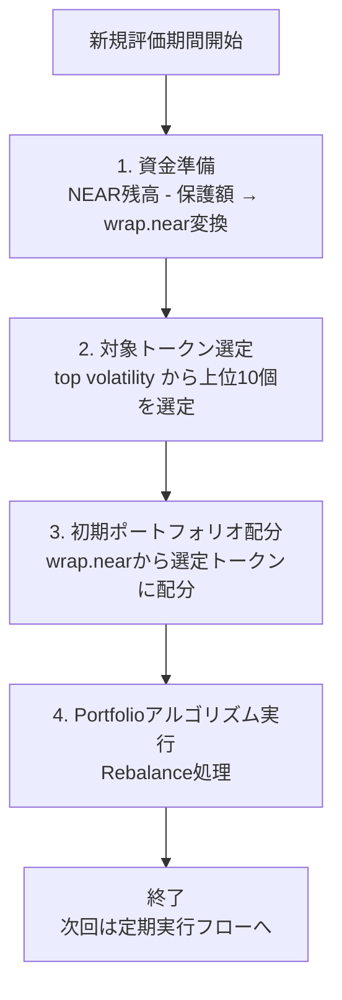
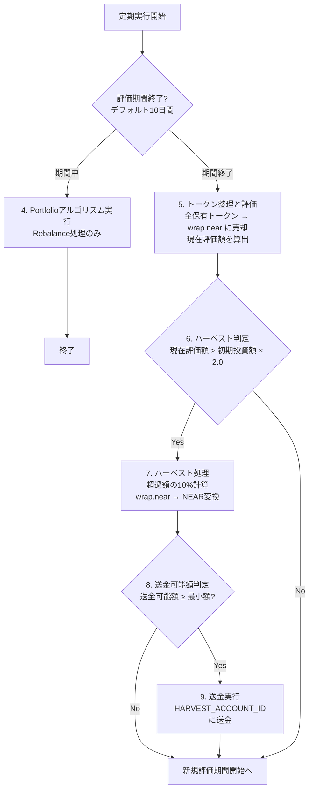

# 自動トレードのルール

## 基本設定

### アルゴリズム
- **使用アルゴリズム**: Portfolio
- **実装場所**: `zaciraci_common::algorithm::portfolio`

### 評価頻度
- **設定項目**: `TRADE_EVALUATION_DAYS`
- **デフォルト値**: 10日間
- **説明**: ポートフォリオを評価・再配分する頻度（次の評価までの運用期間）

### トレード頻度
- **設定項目**: `TRADE_CRON_SCHEDULE`
- **デフォルト値**: 毎日午前0時（1日1回）
- **説明**: 運用期間中の定期的なトレード実行のスケジュール
- **現在の実装**: backend/src/trade.rs で cron 設定（デフォルト: "0 0 0 * * *"）
- **設定例**:
  - `"0 0 0 * * *"`: 毎日午前0時（デフォルト）
  - `"0 0 */12 * * *"`: 12時間ごと
  - `"0 0 * * * *"`: 毎時実行

## トレードルール

### 基本戦略

自動トレードは評価期間（デフォルト10日間）単位で動作し、毎日午前0時に定期実行されます。処理内容は評価期間の状態により異なります。

#### A. 新規評価期間開始時の処理

初回起動時または前の評価期間終了後に、1回だけ実行されます：

1. **資金準備**:
   - アカウントのNEAR残高から保護額を残して wrap.near に変換

2. **対象トークン選定**:
   - top volatility から上位トークンを選定
   - **デフォルト件数**: 10個（`TRADE_TOP_TOKENS=10`で設定可能）

3. **初期ポートフォリオ配分**:
   - wrap.near から選定されたトークンにポートフォリオ配分

4. **Portfolioアルゴリズム実行**:
   - Rebalance処理で最適なトークン配分に調整

#### B. 評価期間中の定期処理（毎日実行）

評価期間中（デフォルト10日間）は、毎日以下の処理のみを実行：

4. **Portfolioアルゴリズム実行**:
   - Rebalance処理で保有トークンの配分を最適化

#### C. 評価期間終了時の処理

評価期間終了時（デフォルト10日目）に、以下の処理を実行：

5. **トークン処理と評価**:
   - 全ての保有トークンを wrap.near に売却
   - ポートフォリオ評価は wrap.near ベースで実行

6. **利益確定（ハーベスト）**:
   - ポートフォリオ評価が初期投資額の200%を超えた場合
   - 超過分の10%を利益として確定
   - wrap.near から NEAR に変換して `HARVEST_ACCOUNT_ID` に送金
   - **最小ハーベスト額**: デフォルト 10 NEAR（`HARVEST_MIN_AMOUNT=10`で設定可能）
   - **アカウント残高保護**: 送金元に最低 1 NEAR を残す（`HARVEST_RESERVE_AMOUNT=1`で設定可能）

   **計算式**:
   ```
   現在評価額 = ポートフォリオ総額（wrap.near換算）
   初期投資額 = 設定された基準額
   最小ハーベスト額 = HARVEST_MIN_AMOUNT (デフォルト: 10 NEAR)
   残高保護額 = HARVEST_RESERVE_AMOUNT (デフォルト: 1 NEAR)

   if 現在評価額 > 初期投資額 * 2.0:
       超過額 = 現在評価額 - (初期投資額 * 2.0)
       ハーベスト対象額 = 超過額 * 0.1

       // ハーベスト対象額をNEARに変換（wrap.near → NEAR）
       // この結果、送金元アカウントのNEAR残高が増加
       送金元NEAR残高 = 変換後のNEAR残高
       送金可能額 = 送金元NEAR残高 - 残高保護額

       if 送金可能額 >= 最小ハーベスト額:
           ハーベスト実行（送金可能額を送金）
   ```

処理完了後、新しい評価期間が開始され、ステップA（新規評価期間開始時の処理）に戻ります。

### 処理フローチャート

#### フロー1: 新規評価期間開始フロー

初回起動時または評価期間終了後に実行されます：



#### フロー2: 定期実行フロー

毎日午前0時（デフォルト設定）に実行されます：



