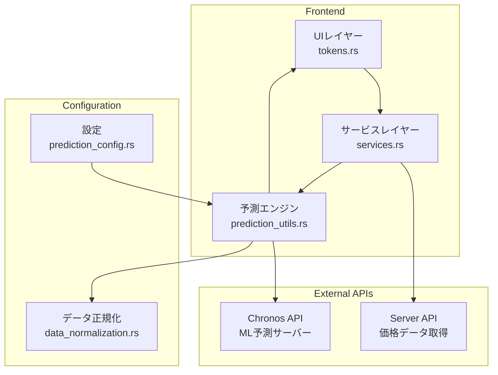
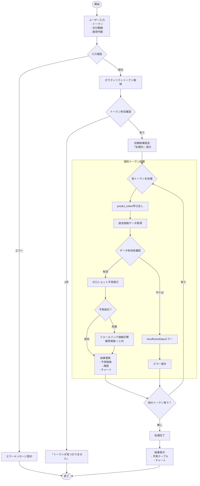
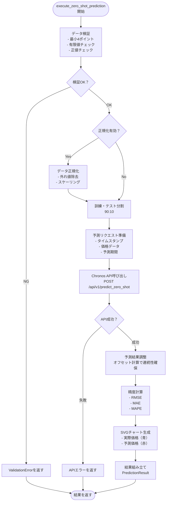
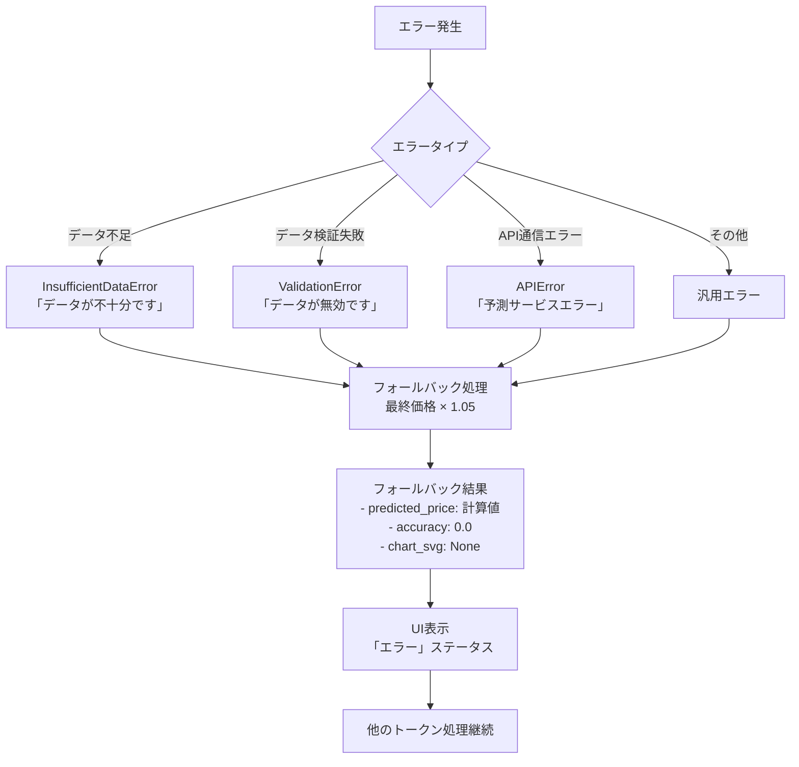

# predict_token 処理フロー

## 概要

`predict_token`は、指定されたトークンの価格予測を実行するための中核的な機能です。機械学習ベースのゼロショット予測を使用して、過去の価格データから将来の価格を予測します。

## 処理の流れ

### 1. UIレイヤー (tokens.rs:141-146)

```rust
service.predict_token(
    &token,
    predict_start,
    predict_end,
    &config.quote_token,
).await
```

**入力パラメータ:**
- `token`: 予測対象のトークン
- `predict_start`: 履歴データの開始日時
- `predict_end`: 履歴データの終了日時
- `quote_token`: 基準通貨（価格比較用）

### 2. サービスレイヤー (services.rs:74-142)

#### 2.1 データ取得リクエストの作成
```rust
let values_request = GetValuesRequest {
    quote_token: quote_token.clone(),
    base_token: token.clone(),
    start: start_datetime.naive_utc(),
    end: end_datetime.naive_utc(),
};
```

#### 2.2 過去価格データの取得
- `api_client.stats.get_values()`を呼び出し
- データが空の場合は`PredictionError::InsufficientData`エラーを返す

#### 2.3 ゼロショット予測の実行
- 取得したデータを`execute_zero_shot_prediction()`に渡す
- 予測結果を`VolatilityPredictionResult`として返す

### 3. 予測エンジン (prediction_utils.rs:34-293)

#### 3.1 データ検証・前処理
- **データサイズ検証**: 最小4ポイント必要
- **データ品質チェック**: 有限値、正の値のみ許可
- **時系列整合性**: 時間順序とユニーク性を検証
- **重複データ除去**: 同一タイムスタンプのデータを統合

#### 3.2 データ正規化（オプション）
```rust
let values_data = if config.enable_normalization {
    let normalizer = DataNormalizer::new(
        config.normalization_window,
        config.outlier_threshold, 
        config.max_change_ratio,
    );
    normalizer.normalize_data(values_data)?
} else {
    values_data.to_vec()
};
```

#### 3.3 訓練・テストデータ分割
- **分割比率**: 90:10（訓練90%、テスト10%）
- **訓練データ**: `values_data[..split_point]`
- **テストデータ**: `values_data[split_point..]`

#### 3.4 予測リクエストの準備
```rust
let prediction_request = if config.omit_model_name {
    ZeroShotPredictionRequest::new(timestamps, values, forecast_until)
} else {
    ZeroShotPredictionRequest::new(timestamps, values, forecast_until)
        .with_model_name(model_name)
};
```

#### 3.5 機械学習モデル実行
- `chronos_client.predict_zero_shot()`を呼び出し
- Chronos APIサーバーの`api/v1/predict_zero_shot`エンドポイントにPOSTリクエスト

#### 3.6 予測結果の調整
データの連続性を保つためのオフセット調整を実行：

```rust
// 実際のデータと予測データを接続するためのオフセット計算
let offset = last_test_point.value - first_api_forecast_value;

// 予測の形状を保持しながらレベルを調整
for (i, timestamp) in prediction_response.forecast_timestamp.iter().enumerate() {
    let adjusted_value = forecast_values[i] + offset;
    // forecast_pointsに追加
}
```

#### 3.7 精度計算
```rust
let metrics = calculate_metrics(&actual_values, &forecast_values);
```

**計算される指標:**
- RMSE (Root Mean Square Error)
- MAE (Mean Absolute Error)  
- MAPE (Mean Absolute Percentage Error)

#### 3.8 チャート生成
- SVGチャートを生成
- 実際の価格（青色）と予測価格（赤色）を表示
- `plot_multi_values_at_time_to_svg_with_options`関数を使用

#### 3.9 結果の組み立て
```rust
PredictionResult {
    predicted_price: 最終予測値,
    accuracy: 100.0 - MAPE,  // 高いほど良い
    chart_svg: 可視化SVG,
    metrics: 性能指標,
    // 生データ（訓練、テスト、予測）
}
```

### 4. エラーハンドリング・フォールバック

予測が失敗した場合のフォールバック機能：

```rust
Err(_) => {
    // フォールバック価格計算
    let fallback_price = values_data
        .last()
        .map(|v| v.value * config.fallback_multiplier)  // デフォルト1.05倍
        .unwrap_or(0.0);
    
    Ok(VolatilityPredictionResult {
        predicted_price: fallback_price,
        accuracy: 0.0,
        chart_svg: None,
    })
}
```

## 設定可能パラメータ

システムは`prediction_config.rs`で高度にカスタマイズ可能：

- **フォールバック倍率**: デフォルト1.05
- **チャートサイズ**: 600x300ピクセル
- **データ正規化設定**: ウィンドウサイズ、外れ値閾値など
- **モデル選択オプション**: モデル名省略可能
- **基準通貨設定**: デフォルトの比較通貨

## システム構成図



## 処理フロー図



## 予測エンジン詳細フロー



## エラーハンドリングフロー



## 主要な特徴

1. **堅牢なエラーハンドリング**: データ不足や予測失敗時の適切な処理
2. **設定可能性**: 豊富な設定オプション
3. **視覚化**: リアルタイムチャート生成
4. **精度評価**: 複数の指標による性能測定
5. **フォールバック機能**: 予測失敗時の代替値提供

## ファイル構成

- `tokens.rs:141-146`: UI呼び出し部分
- `services.rs:74-142`: ビジネスロジック層
- `prediction_utils.rs:34-293`: 予測エンジン本体
- `prediction_config.rs`: 設定管理
- `data_normalization.rs`: データ正規化
- `chronos_api/predict.rs`: API通信層